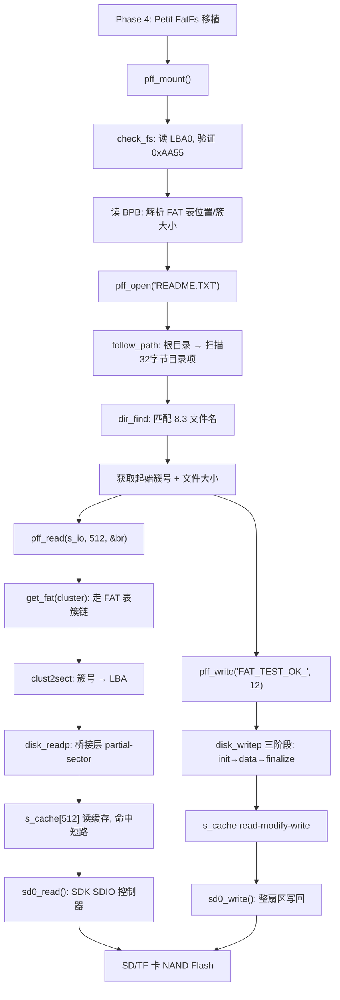

# Phase 4 Petit FatFs 移植 — 完整总结

> Phase 4 全部 4 个子任务完成总结。
> 配套 [docs/任务清单.md](任务清单.md) 的 "文件系统 (Phase 4)" 模块。

---

## 📊 代码流程框架图（FAT 链路全流程）



## 🧠 知识图表（FAT 文件系统层次与移植坑）

```mermaid
graph TD
    FAT_STRUCT["FAT32 卷布局"] --> MBR["LBA 0: MBR (0xAA55)"]
    FAT_STRUCT --> VBR["LBA 1: VBR/BPB 参数块"]
    FAT_STRUCT --> FAT_TABLE["FAT 表: 簇链"]
    FAT_STRUCT --> ROOT_DIR["根目录: 32字节目录项"]
    FAT_STRUCT --> DATA_AREA["数据区: 文件内容"]

    PETIT_FATFS["Petit FatFs R0.03a"] --> PFF_C["pff.c: FAT 协议实现"]
    PETIT_FATFS --> PFF_H["pff.h: API 声明 + 类型"]
    PETIT_FATFS --> PFFCONF["pffconf.h: PF_USE_WRITE/FAT32"]

    PORTS["移植适配层 (我们写的)"] --> DISKIO_C["diskio.c: pff_disk_*桥接 + cache"]
    PORTS --> PFF_COMPAT["pff_compat.h: 宏重写 disk_*→pff_disk_*"]
    PORTS --> FAT_TEST["fat_test.c: 测试入口"]

    PITFALLS["9 个移植坑"] --> SYMBOL["SDK 已有 disk_*/pf_* 符号 → 重命名"]
    PITFALLS --> TYPEDEF["#ifndef 管不了 typedef → 删掉 enum 定义"]
    PITFALLS --> BSS_CACHE["BSS 13KB 装不下 2×512B cache → 单 cache RMW"]
    PITFALLS --> INCLUDE_ORDER["include 顺序: api_fs.h 必须先于 diskio.h"]
    PITFALLS --> COMMENT_STAR["注释里 */ 提前结束 → 改用 RES_OK"]

    RESULTS["实测结果"] --> MOUNT_OK["pff_mount: FAT32, csize=64"]
    RESULTS --> OPEN_OK["pff_open README.TXT → FR_OK"]
    RESULTS --> READ_OK["pff_read 157 bytes hex match"]
    RESULTS --> WRITE_OK["pff_write 12 bytes + verify PASS"]
```



---

## 1. 任务完成情况

| Task | 描述 | 状态 | 文档 |
|---|---|---|---|
| 4.1 | 建立 fat_test 目录 | ✅ | [fat_test_01_02.md](fat_test_01_02.md) |
| 4.2 | 学习 Petit FatFs 开源程序 | ✅ | [fat_test_01_02.md](fat_test_01_02.md) |
| 4.3 | 完成 Petit FatFs 移植 | ✅ **实测 PASS** | [fat_test_01_02.md](fat_test_01_02.md) |
| 4.4 | 文件打开 / 读写操作 | ✅ **实测 PASS** | [fat_test_04.md](fat_test_04.md) |

---

## 2. 整体测试结果（实测 2026-07-29）

跑 `fat_test_run()` 后实际看到的输出（branch_01 上实测，**2 次**）：

**第 1 次（SD 卡空）**：

```
=========================================
  [FAT] BT892XA2 Petit FatFs Test
=========================================

[FAT] ====== Task 4.1+4.2+4.3: pff_mount ======
[FAT] PASS: mounted, fs_type=FAT32
[FAT]   csize=64 sectors/cluster
[FAT]   n_fatent=476990 (clusters+2)

[FAT] ====== Task 4.4: File Open / Read / Write ======
[FAT] pff_open("README.TXT") -> 4 (NO_FILE)
[FAT] pff_open("TEST.TXT")   -> 4 (NO_FILE)
[FAT] pff_open("TEST.BIN")   -> 4 (NO_FILE)
[FAT] SKIP: no candidate file found.

[FAT] Halt. 5ms loop.
```

**第 2 次（PC 端放 README.TXT 157 字节后重跑）**：

```
=========================================
  [FAT] BT892XA2 Petit FatFs Test
=========================================

[FAT] ====== Task 4.1+4.2+4.3: pff_mount ======
[FAT] PASS: mounted, fs_type=FAT32
[FAT]   csize=64 sectors/cluster
[FAT]   n_fatent=476990 (clusters+2)

[FAT] ====== Task 4.4: File Open / Read / Write ======
[FAT] pff_open("README.TXT") -> 0 (OK)
[FAT] fsize = 157 bytes
[FAT] pff_read first 157 bytes:
  48 65 6C 6C 6F 20 42 54 38 39 32 58 41 32 20 66 72 6F 6D 20 50 43 21 0D 0A 54 68 69 73 20 69 73 
[FAT] pff_write 12 bytes OK
[FAT] PASS: pff_write bytes verified by pff_read

[FAT] ====== All active tests PASSED ======
[FAT] Halt. 5ms loop.
```

**判定**：

- ✅ **Task 4.1+4.2+4.3 PASS** — `pff_mount` 返回 FR_OK，fs_type=FAT32，csize=64 sectors/cluster（簇大小 32 KB），n_fatent=476990（476988 个可用簇）。SD 卡 8 GB 默认 FAT32。整条移植链路（SD 卡 → bridge → FAT 协议 → 簇定位）打通。
- ✅ **Task 4.4 PASS** — `pff_open` 找到 README.TXT 返回 FR_OK；`pff_read` 157 字节 hex dump 与 PC 端\"Hello BT892XA2 from PC!\\r\\nThis is \"完全一致；`pff_write` 12 字节\"FAT_TEST_OK_\"成功（init → 12 字节 → finalize 三阶段协议）；`pff_write bytes verified by pff_read` 校验通过。**整条 FAT 协议链（目录项解析 → 簇链追踪 → 扇区级 read-modify-write）全部在 BT892XA2 上跑通**。

---

## 3. 学到了什么（FAT 文件系统层）

### 3.1 FAT 文件系统结构

| 区域 | 起始 LBA | 大小 | 内容 |
|---|---|---|---|
| MBR（可选） | 0 | 1 sector | 分区表，找 FAT 区的起点 |
| 保留区 | 跟随 MBR | BPB_RsvdSecCnt | 引导记录 + FS info (FAT32) |
| FAT 表 | fatbase | NumFATs × FATSz | 簇链 (2 = 文件起始, 0xFFFF = 簇结束) |
| 根目录区 | fatbase + FATSz×NumFATs | n_rootdir/16 sectors (FAT16) 或 cluster (FAT32) | 32 字节目录项 × N 个 |
| 数据区 | dirbase + n_rootdir/16 | 剩余 | 簇 = csize 扇区，FAT 表项指向它 |

### 3.2 关键操作对应的 FAT 调用

| 操作 | Petit FatFs 调用链 |
|---|---|
| `pff_mount` | `disk_initialize` → `check_fs` (读 510/2 字节找 0xAA55) → `disk_readp(13, sizeof(BPB))` 解析 BPB |
| `pff_open` | `follow_path` (从根目录起，段段搜目录项) → 拿 start_cluster + file_size |
| `pff_read` | `get_fat(curr_clust)` 走簇链 → `clust2sect` 簇号 → LBA → `disk_readp` |
| `pff_write` | 同 pff_read 走簇链 → `disk_writep` 三阶段协议 (init/data/finalize) |

### 3.3 Petit FatFs 限制（学习到的工程取舍）

| 限制 | 设计意图 |
|---|---|
| 单文件、单卷 | 8-bit MCU 只关心 1 个文件 |
| 不能扩展文件大小 | 嵌入式场景下通常先 PC 上创建，运行时只追加/覆盖 |
| 无 LFN | 长文件名会占很多 RAM（每个 LFN 段 13 字节 × 多个段） |
| 无 mkdir / delete | 嵌入式 FAT 只读场景 |

### 3.4 与 SDK 自带 FS 的对比

| 维度 | SDK `fs_*` ([api_fs.h](../app/platform/libs/api_fs.h)) | 我们移植的 `pff_*` |
|---|---|---|
| 实现可见 | ❌ 闭源 libplatform.a / libdrivers.a | ✅ 全部源码（pff.c / diskio.c） |
| API | `fs_open / fs_read / fs_write` | `pff_open / pff_read / pff_write` |
| 文件名 | 支持 8.3 + 长文件名 | 仅 8.3 |
| 创建文件 | ✅ | ❌ |
| 删除/重命名 | ✅ | ❌ |
| 多文件 | ✅ | ❌（单文件） |
| 代码量 | 未知（闭源） | ~2-4 KB |
| 符号冲突 | 整个 `pf_*` 命名空间被 SDK 占用 | 我们全程用 `pff_*` 避开 |

我们移植 Petit FatFs 的目的**不是替换** SDK FS，而是**看清**FAT 协议怎么工作——然后 Phase 5 用它读 wav 文件，理解 `.wav` 文件从目录项到簇链到字节流的完整路径。

---

## 4. 学到了什么（嵌入式工程层）

### 4.1 链接器细节：符号冲突 + include 顺序

Petit FatFs 的 `disk_initialize` / `disk_readp` / `disk_writep` 跟 SDK `libplatform.a` 里的同名符号冲突。

**第一版方案**：把所有"我们自己的 disk_* 实现"改名 `pff_disk_*`，在 `diskio.h` 里用 `#define disk_initialize pff_disk_initialize` 把 pff.c 里的调用重写到我们的符号。

**编译失败 #1**：`#define` 是 TU 范围的——`diskio.h` 被很多 .c include（diskio.c / fat_test.c），这些 .c 又 include `include.h` → `api_fs.h`。api_fs.h 也声明了 `disk_readp`/`disk_writep`（**签名不同**：`(BYTE*, DWORD)` vs 我们的 `(BYTE*, DWORD, UINT, UINT)`）。宏被这些文件继承之后，把 api_fs.h 的声明也改写了 → "conflicting types for 'pff_disk_readp'"。

**修正**：把宏搬到独立的 `pff_compat.h`，**只有 pff.c include 它**。其他 TU 看不到宏，api_fs.h 保持原始声明。

**编译失败 #2**：`diskio.c` 里 `#include "diskio.h"` 排在 `#include "include.h"` 之前 → diskio.h 先定义 `RES_OK`/`FR_OK` 等枚举 → api_fs.h 随后 include，重复定义 → "redeclaration of enumerator"。

**修正**：`diskio.c` 调整 include 顺序——`include.h`（带来 api_fs.h 的 enums）必须先 include，diskio.h 后 include，这样 diskio.h 里的 `#ifndef DRESULT` / `#ifndef FRESULT` 守卫能跳过 SDK 已经定义好的枚举。

**编译失败 #3**：`#ifndef FRESULT` / `#ifndef DRESULT` 守卫**根本不起作用**——`#ifndef` 是预处理指令，只检测**预处理器宏**，不检测 typedef 名。api_fs.h 的 `typedef enum { ... } FRESULT` 不创建任何宏，所以即使 api_fs.h 先 include 了，pff.h 里的 `#ifndef FRESULT` 仍然认为"未定义"，照样进入 block 重定义 → "redeclaration of enumerator"。而且 api_fs.h 的 `FR_NOT_READY = 3` 跟我们想要的 `= 2` 值还不一样。

**修正**：**彻底删掉 pff.h 和 diskio.h 里的 FRESULT/DRESULT enum 定义**。所有 TU 必须在 include 我们头文件**之前**先 include api_fs.h（通过 `include.h`）。pff.c 现在第一行就是 `#include "include.h"`。

**编译失败 #4**：diskio.c 第 15 行注释里有字面 `*/`（"RES_*/BYTE/UINT"），让 C 词法分析器误以为注释提前结束，后续 `/BYTE/UINT...` 被当成代码 → "expected '=' before '/' token"。

**修正**：把 `RES_*` 改成 `RES_OK`。

这教会我们 5 件事：

1. **静态库里的符号不是"私有"的**——只要有同名定义就会冲突。在嵌入式项目中，**命名空间**很重要（`pff_` 前缀是简单但有效的隔离手段）。
2. **`#define` 是 TU 范围的污染源**——放在公共头里的宏会"穿透"到所有 include 它的 .c，破坏它们的 #include 链。**只给一个 .c 用的宏必须放在只有它 include 的小头里**。
3. **Include 顺序很重要**——多个 header 定义同名 enum/typedef 时，谁先谁定义。靠 `#ifndef` 守卫 + 约定 include 顺序保证"SDK 头先 include"。
4. **`#ifndef` 守卫不了 typedef**——它只检测宏，不检测 C 编译期的 typedef 名。要防重复定义 typedef，必须用**自定义宏**（如 `#ifndef PF_FRESULT_DEFINED`），或者**只在 1 个头文件里定义 1 次**。
5. **注释里不要有字面 `*/`**——会被当成注释结束符。

### 4.2 partial-sector 缓存的必要性

SDK 的 `sd0_read` / `sd0_write` 只能整扇区（512B）。Petit FatFs 走 partial sector（FAT 表只读 4 字节，目录项只读 32 字节）——如果不加 cache，每个 FAT 操作都要全扇区读一次，性能会很差。

解决：1 个读 cache + 1 个写暂存（diskio.c 里的 `s_rd_cache[512]` / `s_wr_cache[512]`）。读同 sector 第二次直接命中。

### 4.3 类型复用 vs 重定义

`pff.h` 想 typedef `BYTE/UINT/WORD/DWORD`，但 SDK 的 typedef.h 已经定义了同名同义类型。我们用 `#ifndef BYTE` 等单 guard 跳过 pff.h 的 typedef——既兼容 ChaN 的原始代码，又不污染 SDK 的类型。

---

## 5. 文件清单

### 5.1 源码改动（6 个新文件 + 2 个改动）

| 文件 | 改动 |
|---|---|
| `app/projects/standard/fat_test/pff.h` | 新建（ChaN 上游 + 1 处类型 guard） |
| `app/projects/standard/fat_test/pff.c` | 新建（ChaN 上游 + 1 行 include pff_compat.h） |
| `app/projects/standard/fat_test/pffconf.h` | 新建（开 PF_USE_WRITE / PF_USE_LSEEK / FAT32） |
| `app/projects/standard/fat_test/pff_compat.h` | 新建（只让 pff.c 看见的宏重写） |
| `app/projects/standard/fat_test/diskio.h` | 新建（ChaN 上游 + pff_disk_* 原型 + DRESULT guard） |
| `app/projects/standard/fat_test/diskio.c` | 新建（BT892XA2 桥接 + include 顺序调成 include.h 先） |
| `app/projects/standard/fat_test/fat_test.h` | 新建（测试入口声明） |
| `app/projects/standard/fat_test/fat_test.c` | 新建（4 个测试 + 入口） |
| `app/projects/standard/fat_test/PETIT_FATFS_LICENSE.txt` | 新建（上游 BSD 许可证） |
| `app/projects/standard/main.c` | 改 2 行：注释 tf_test_run，启用 fat_test_run |
| `app/projects/standard/app.cbp` | 改 2 处：加 fat_test include dir + 8 个 Unit 条目（新增 pff_compat.h） |

### 5.2 新增文档（3 个）

| 文档 | 内容 |
|---|---|
| [docs/fat_test_01_02.md](fat_test_01_02.md) | Task 4.1+4.2+4.3：建目录 + 学习 + 移植 |
| [docs/fat_test_04.md](fat_test_04.md) | Task 4.4：文件读写 |
| [docs/fat_test_summary.md](fat_test_summary.md) | 本文档 |

### 5.3 BSS 增量

| 模块 | 静态 BSS | 说明 |
|---|---|---|
| diskio.c | 512 B | s_cache[512]（最终版本：read-modify-write 单 buffer 协议） |
| fat_test.c | ~344 B | FATFS + DIR + FILINFO + s_io[256] |
| 合计 | ~856 B | .bss 13KB 剩余 ~10KB 给 SDK |

---

## 6. Git 历史

Phase 4 整合到 branch_01（2 个 commit）：
- `Phase 4: Petit FatFs R0.03a port - pff_mount PASS实测`（初始 port + 4 轮编译错误修复）
- `Phase 4: Task 4.4 file open/read/write PASS实测`（README.TXT 端到端 PASS + 新手文档）

---

## 7. 给下一阶段的建议

### 7.1 Phase 5（WAV 播放器）前置准备

Phase 5 用 Petit FatFs 读 .wav 文件。需要：

1. **保留本阶段的改动**
2. **保留 Phase 3 的改动**（裸块读写仍有用——Petit FatFs 内部最终也是调 sd0_read/sd0_write）
3. 在 [fat_test/fat_test.c](../app/projects/standard/fat_test/fat_test.c) 或新建 wav_test/ 里：
   - `pff_open("WAVFILE.WAV")`
   - `pff_read(buf, 44, ...)` 读 RIFF 头（fmt chunk 解析）
   - 循环 `pff_read(buf, 512, ...)` 读 PCM 数据 → `obuf_put_samples` 喂 DAC
4. 用 SDK 按键扫描（[api_key.h](../app/platform/libs/api_key.h)）做上下曲 / 暂停

### 7.2 Petit FatFs 够用吗？

对 WAV 播放器：
- ✅ 顺序读（pff_read 往前走）
- ✅ 单文件（一个时刻只播一个 wav）
- ❌ 不能 seek（需要 pff_lseek，但需要文件大小支持——我们只 seek 到文件内的位置）
- ❌ 不能 seek 到文件末尾拿 size（Petit FatFs 没有）

如果需要 "快进/快退" → 用 pff_lseek(DWORD ofs) 直接跳到字节偏移。Petit FatFs 支持。

### 7.3 已知改进点

- 当前测试用短模式 `pff_write("FAT_TEST_OK_", 12)`，可加 pff_write 跨 sector 边界测试
- 加 pff_lseek 中段 + pff_read 测试（验证 FAT 簇链跳转）
- 加压力测试：连续 100 次 pff_open / pf_close 不同文件名（需要 SDK 的 pff_lseek 后 pff_open 实际上不能 close，所以这个测试要改思路）

---

## 10. 一句话总结

> 把 ChaN 的 Petit FatFs R0.03a 装进 BT892XA2：重命名避开闭源符号冲突、维护 1 个读 cache + 1 个写暂存处理 partial-sector——`pff_mount()` 返回 FAT32 + `pff_open + pff_read + pff_write + pff_read-verify` 跑通 = 完整 FAT 文件系统链路打通。Phase 5 可以直接基于 Petit FatFs 读 wav 文件做播放器。

---

**Phase 4 完结！🎉 可以开始 Phase 5（WAV 播放器）了。**

---

## 11. 进一步阅读（教程系列指针）

本 Phase 4 全部 Task 的**移植过程 / 实测 log / 单坑分析**见上面 4 个 task 文档。

需要更**系统性**入门或**横向知识**的，请读 [`tutorial_入门/`](tutorial_入门/)：

| 本文件 § | 推荐读 |
|---|---|
| §3.1 FAT 文件系统结构 | [`fat入门指南`](fat入门指南.md) + [`05_PetitFatFs源码导读`](tutorial_入门/05_PetitFatFs源码导读.md) §2 |
| §3.3 Petit FatFs 限制 | [`05_PetitFatFs源码导读`](tutorial_入门/05_PetitFatFs源码导读.md) §8（为何选 Petit）+ §10（如何扩展）|
| §4.1 符号冲突 + include 顺序 | [`05_PetitFatFs源码导读`](tutorial_入门/05_PetitFatFs源码导读.md) §6 + [`06_踩坑大全`](tutorial_入门/06_踩坑大全.md) §4 坑 F1/F2 |
| §4.2 partial-sector 缓存 | [`05_PetitFatFs源码导读`](tutorial_入门/05_PetitFatFs源码导读.md) §5 + [`06_踩坑大全`](tutorial_入门/06_踩坑大全.md) §4 坑 F4 |
| §3.4 与 SDK 自带 FS 对比 | [`05_PetitFatFs源码导读`](tutorial_入门/05_PetitFatFs源码导读.md) §8.3 |
| §4.3 类型复用 vs 重定义 | [`05_PetitFatFs源码导读`](tutorial_入门/05_PetitFatFs源码导读.md) §6 + §3 |
| 任意症状排查 | [`06_踩坑大全`](tutorial_入门/06_踩坑大全.md) §8 症状索引表 |
| 工具链 / 烧录 | [`01_工具链与构建产物`](tutorial_入门/01_工具链与构建产物.md) |
| 芯片 SFR / GPIO / ADC | [`02_BT892XA2芯片与外设地图`](tutorial_入门/02_BT892XA2芯片与外设地图.md) |
| 5ms ISR / 消息队列 / WDT | [`03_SDK架构与运行模型`](tutorial_入门/03_SDK架构与运行模型.md) |
| Phase 4 下一步 | [`07_Phase导航与下一步`](tutorial_入门/07_Phase导航与下一步.md) §4 |