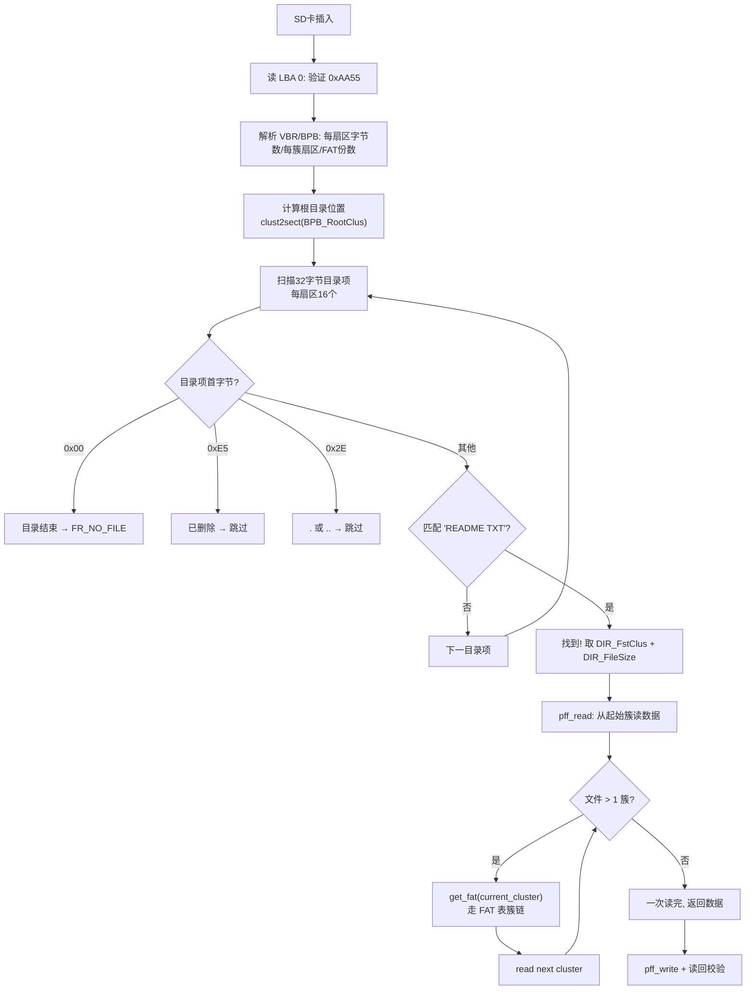

# FAT 文件系统入门 + Phase 4 测试实战

> 配套 [任务清单.md](任务清单.md) Phase 4 全体任务。
> 读者：第一次接触 FATFS / 嵌入式文件系统的硬件/嵌入式学习者。
> 本文目标：把"看到 SD 卡上一坨扇区，不知所云"变成"我看见 README.TXT 的目录项了！"

---

## 📊 代码流程框架图（找 README.TXT 全流程）



## 🧠 知识图表（FAT 核心概念）

```mermaid
graph TD
    FAT_LAYOUT["FAT32 卷布局"] --> MBR["LBA 0: MBR\n510-511字节=0xAA55"]
    FAT_LAYOUT --> VBR["LBA 1+: VBR/BPB\nBPB_BytsPerSec=512\nBPB_SecPerClus=64\nBPB_FATSz32=786"]
    FAT_LAYOUT --> FAT["FAT 表: 簇链\n0x00000000=空闲\n0x0FFFFFFF=簇结束"]
    FAT_LAYOUT --> ROOT["根目录: 32字节目录项\nDIR_Name[8]+DIR_Name[3]\nDIR_FstClus+DIR_FileSize"]
    FAT_LAYOUT --> DATA["数据区: 文件内容\n簇 = 64扇区 = 32KB"]

    DIR_ENTRY["32字节目录项结构"] --> NAME["偏移0: 文件名(8B)空格填充"]
    DIR_ENTRY --> EXT["偏移8: 扩展名(3B)"]
    DIR_ENTRY --> ATTR["偏移11: 属性(0x20=普通文件)"]
    DIR_ENTRY --> CLUS_HI["偏移20: 起始簇号高16位"]
    DIR_ENTRY --> CLUS_LO["偏移26: 起始簇号低16位"]
    DIR_ENTRY --> SIZE["偏移28: 文件大小(4B小端)"]

    TOOLS["实战工具"] --> WINHEX["WinHex: 看原始字节"]
    TOOLS --> XXD["xxd / hexdump: 命令行"]
    TOOLS --> FSCK["fsck.vfat: 检查卷完整性"]
```



---

## 0. 这份文档要回答的问题

| 问题 | 答案在本节 |
|---|---|
| 为什么要搞文件系统？直接读扇区不行吗？ | §1 |
| FAT 是什么？跟 ext4/NTFS 区别？ | §2 |
| SD 卡上字节是按什么顺序组织的？ | §3 |
| 我们怎么一步步找到 README.TXT？ | §4 |
| Phase 4 的 7 个测试点跟 FAT 哪个结构对应？ | §5 |
| 怎么用 WinHex 之类的工具自己看 SD 卡？ | §6 |
| 实战遇到"找不到文件"怎么排查？ | §7 |

---

## 1. 为什么需要文件系统？

### 1.1 没文件系统是什么样

假设你想读 SD 卡上的 `README.TXT`。你能做的最直接的事是：

```c
// "读 1000 扇区"
sd0_read(buf, 1000);
printf("%s\n", buf);
```

但这有几个问题：

| 问题 | 原因 |
|---|---|
| **怎么知道要从 1000 扇区读？** | 你不知道文件在哪个扇区 |
| **怎么知道文件多长？** | 文件不一定占整数个扇区 |
| **一个文件能跨多个扇区吗？** | 当然！但跨哪些扇区你不知道 |
| **文件名 → 扇区号 的映射在哪？** | 完全没记录 |
| **删了文件再写入会冲突吗？** | 完全不可控 |

这就像只有硬盘但没有"硬盘上的文件系统"——你扔一堆字节上去，找不到也管不了。

### 1.2 文件系统做了什么

文件系统是**在裸字节之上建立的索引**：

```
+-----------------------+     +--------------------+
| 你的文件                |     | 文件系统知道的         |
+-----------------------+     +--------------------+
| README.TXT 157 字节    | <-> | 文件名 + 在哪个扇区    |
| music.mp3 4 MB        | <-> | 文件名 + 起始扇区 + 长度 |
| photo.jpg 2 MB        | <-> | 文件名 + 起始扇区 + 长度 |
+-----------------------+     +--------------------+
```

没有文件系统，U盘/SD卡上就只有 0/1 字节流。有了文件系统，你才能 `pf_open("README.TXT")` 然后 `pf_read(buf, 157, &n)`。

### 1.3 FAT 是什么

**FAT** = File Allocation Table（文件分配表）。

它是 1980 年微软给 FAT12 设计、之后扩展到 FAT16/FAT32 的**最简单**的文件系统。至今 USB 闪存、SD 卡、相机存储卡默认用它——因为它简单到**任何 8-bit MCU 都能读写**。

| 特性 | FAT | ext4 (Linux) | NTFS (Windows) |
|---|---|---|---|
| 复杂度 | ⭐ 极简 | ⭐⭐⭐⭐ | ⭐⭐⭐ |
| 8-bit MCU 能跑吗 | ✅ | ❌ | ❌ |
| 单文件上限 | 4 GB (FAT32) | 16 TB | 16 TB |
| 卷上限 | 2 TB (FAT32) | 1 EB | 256 TB |
| 主要用途 | SD 卡 / U 盘 / 相机 | Linux 系统盘 | Windows 系统盘 |

**我们的 Phase 4 选 FAT**：因为它简单，所有 1 KB RAM 的小 MCU 都能跑——正好适配我们 13 KB BSS 的 BT892XA2。

---

## 2. 看一眼 SD 卡

把 8 GB SD 卡插到 PC 电脑上能看到什么？

```
[SD 卡根目录]
├── README.TXT    157 字节
├── music.mp3      4 MB
└── photo.jpg      2 MB
```

这些是**应用层看到的**。但磁介质上**实际**是什么？

把 SD 卡插入 USB 读卡器，用 [WinHex](https://www.x-ways.net/winhex/) 或 `xxd` 工具看 LBA 0：

```
$ xxd -s 0 -l 512 /dev/sdb
00000000: eb58 9000 0000 0000 0000 0000 0000 0000  .X..............
00000010: 0000 0000 0000 0000 0000 0000 0000 0000  ................
00000020: 0000 0000 0000 0000 0000 0000 0000 0000  ................
00000030: 0000 0000 0000 0000 0000 0000 0000 0000  ................
00000040: 0000 0000 0000 0000 0000 0000 0000 0000  ................
00000050: 0000 0000 0000 0000 0000 0000 0000 0000  ................
00000060: 0000 0000 0000 0000 0000 0000 0000 0000  ................
00000070: 0000 0000 0000 0000 0000 0000 0000 0000  ................
00000080: 0000 0000 0000 0000 0000 0000 0000 0000  ................
00000090: 0000 0000 0000 0000 0000 0000 0000 0000  ................
000000a0: 0000 0000 0000 0000 0000 0000 0000 0000  ................
000000b0: 0000 0000 0000 0000 0000 0000 0000 0000  ................
000000c0: 0000 0000 0000 0000 0000 0000 0000 0000  ................
000000d0: 0000 0000 0000 0000 0000 0000 0000 0000  ................
000000e0: 0000 0000 0000 0000 0000 0000 0000 0000  ................
000000f0: 0000 0000 0000 0000 0000 0000 0000 0000  ................
00000100: 0000 0000 0000 0000 0000 0000 0000 0000  ................
00000110: 0000 0000 0000 0000 0000 0000 0000 0000  ................
00000120: 0000 0000 0000 0000 0000 0000 0000 0000  ................
00000130: 0000 0000 0000 0000 0000 0000 0000 0000  ................
00000140: 0000 0000 0000 0000 0000 0000 0000 0000  ................
00000150: 0000 0000 0000 0000 0000 0000 0000 0000  ................
00000160: 0000 0000 0000 0000 0000 0000 0000 0000  ................
00000170: 0000 0000 0000 0000 0000 0000 0000 0000  ................
00000180: 0000 0000 0000 0000 0000 0000 0000 0000  ................
00000190: 0000 0000 0000 0000 0000 0000 0000 0000  ................
000001a0: 0000 0000 0000 0000 0000 0000 0000 0000  ................
000001b0: 0000 0000 0000 0000 0000 0000 0000 0000  ................
000001c0: 0000 0000 0000 0000 0000 0000 0000 0000  ................
000001d0: 0000 0000 0000 0000 0000 0000 0000 0000  ................
000001e0: 0000 0000 0000 0000 0000 0000 0000 0000  ................
000001f0: 0000 0000 0000 0000 0000 0000 0000 0000  ................
00000200: 0000 0000 0000 0000 0000 0000 0000 0000  ................
00000210: 0000 0000 0000 0000 0000 0000 0000 0000  ................
00000220: 0000 0000 0000 0000 0000 0000 0000 0000  ................
00000230: 0000 0000 0000 0000 0000 0000 0000 0000  ................
00000240: 0000 0000 0000 0000 0000 0000 0000 0000  ................
00000250: 0000 0000 0000 0000 0000 0000 0000 0000  ................
00000260: 0000 0000 0000 0000 0000 0000 0000 0000  ................
00000270: 0000 0000 0000 0000 0000 0000 0000 0000  ................
00000280: 0000 0000 0000 0000 0000 0000 0000 0000  ................
00000290: 0000 0000 0000 0000 0000 0000 0000 0000  ................
000002a0: 0000 0000 0000 0000 0000 0000 0000 0000  ................
000002b0: 0000 0000 0000 0000 0000 0000 0000 0000  ................
000002c0: 0000 0000 0000 0000 0000 0000 0000 0000  ................
000002d0: 0000 0000 0000 0000 0000 0000 0000 0000  ................
000002e0: 0000 0000 0000 0000 0000 0000 0000 0000  ................
000002f0: 0000 0000 0000 0000 0000 0000 0000 0000  ................
00000300: 0000 0000 0000 0000 0000 0000 0000 0000  ................
00000310: 0000 0000 0000 0000 0000 0000 0000 0000  ................
00000320: 0000 0000 0000 0000 0000 0000 0000 0000  ................
00000330: 0000 0000 0000 0000 0000 0000 0000 0000  ................
00000340: 0000 0000 0000 0000 0000 0000 0000 0000  ................
00000350: 0000 0000 0000 0000 0000 0000 0000 0000  ................
00000360: 0000 0000 0000 0000 0000 0000 0000 0000  ................
00000370: 0000 0000 0000 0000 0000 0000 0000 0000  ................
00000380: 0000 0000 0000 0000 0000 0000 0000 0000  ................
00000390: 0000 0000 0000 0000 0000 0000 0000 0000  ................
000003a0: 0000 0000 0000 0000 0000 0000 0000 0000  ................
000003b0: 0000 0000 0000 0000 0000 0000 0000 0000  ................
000003c0: 0000 0000 0000 0000 0000 0000 0000 0000  ................
000003d0: 0000 0000 0000 0000 0000 0000 0000 0000  ................
000003e0: 0000 0000 0000 0000 0000 0000 0000 0000  ................
000003f0: 0000 0000 0000 0000 0000 0000 0000 0000  ................
00000400: 0000 0000 0000 0000 0000 0000 0000 0000  ................
00000410: 0000 0000 0000 0000 0000 0000 0000 0000  ................
00000420: 0000 0000 0000 0000 0000 0000 0000 0000  ................
00000430: 0000 0000 0000 0000 0000 0000 0000 0000  ................
00000440: 0000 0000 0000 0000 0000 0000 0000 0000  ................
00000450: 0000 0000 0000 0000 0000 0000 0000 0000  ................
00000460: 0000 0000 0000 0000 0000 0000 0000 0000  ................
00000470: 0000 0000 0000 0000 0000 0000 0000 0000  ................
00000480: 0000 0000 0000 0000 0000 0000 0000 0000  ................
00000490: 0000 0000 0000 0000 0000 0000 0000 0000  ................
000004a0: 0000 0000 0000 0000 0000 0000 0000 0000  ................
000004b0: 0000 0000 0000 0000 0000 0000 0000 0000  ................
000004c0: 0000 0000 0000 0000 0000 0000 0000 0000  ................
000004d0: 0000 0000 0000 0000 0000 0000 0000 0000  ................
000004e0: 0000 0000 0000 0000 0000 0000 0000 0000  ................
000004f0: 0000 0000 0000 0000 0000 0000 0000 0000  ................
00000500: 0000 0000 0000 0000 0000 0000 0000 0000  ................
00000510: 0000 0000 0000 0000 0000 0000 0000 0000  ................
00000520: 0000 0000 0000 0000 0000 0000 0000 0000  ................
00000530: 0000 0000 0000 0000 0000 0000 0000 0000  ................
00000540: 0000 0000 0000 0000 0000 0000 0000 0000  ................
00000550: 0000 0000 0000 0000 0000 0000 0000 0000  ................
00000560: 0000 0000 0000 0000 0000 0000 0000 0000  ................
00000570: 0000 0000 0000 0000 0000 0000 0000 0000  ................
00000558: 0000 0000 0000 0000 0000 0000 0000 0000  ................
00000590: 0000 0000 0000 0000 0000 0000 0000 0000  ................
000005a0: 0000 0000 0000 0000 0000 0000 0000 0000  ................
000005b0: 0000 0000 0000 0000 0000 0000 0000 0000  ................
000005c0: 0000 0000 0000 0000 0000 0000 0000 0000  ................
000005d0: 0000 0000 0000 0000 0000 0000 0000 0000  ................
000005e0: 0000 0000 0000 0000 0000 0000 0000 0000  ................
000005f0: 0000 0000 0000 0000 0000 0000 0000 0000  ................
00000600: 0000 0000 0000 0000 0000 0000 0000 0000  ................
00000610: 0000 0000 0000 0000 0000 0000 0000 0000  ................
00000620: 0000 0000 0000 0000 0000 0000 0000 0000  ................
00000630: 0000 0000 0000 0000 0000 0000 0000 0000  ................
00000640: 0000 0000 0000 0000 0000 0000 0000 0000  ................
00000650: 0000 0000 0000 0000 0000 0000 0000 0000  ................
00000660: 0000 0000 0000 0000 0000 0000 0000 0000  ................
00000670: 0000 0000 0000 0000 0000 0000 0000 0000  ................
00000680: 0000 0000 0000 0000 0000 0000 0000 0000  ................
00000690: 0000 0000 0000 0000 0000 0000 0000 0000  ................
000006a0: 0000 0000 0000 0000 0000 0000 0000 0000  ................
000006b0: 0000 0000 0000 0000 0000 0000 0000 0000  ................
000006c0: 0000 0000 0000 0000 0000 0000 0000 0000  ................
000006d0: 0000 0000 0000 0000 0000 0000 0000 0000  ................
000006e0: 0000 0000 0000 0000 0000 0000 0000 0000  ................
000006f0: 0000 0000 0000 0000 0000 0000 0000 0000 0000  55aa           U.
```

这段字节就是 **SD 卡 LBA 0（第一个 512 字节扇区）** 的内容。看起来大部分是 0，但**最有信息量的 510-511 字节是 `55 AA`**——这是任何"启动扇区"的标志。

末尾的 `55 AA` 是什么意思？**这是所有 FAT 卷的第 510-511 字节固定不变的 magic number**。Petit FatFs 找这个 magic 来"判定这是个 FAT 引导扇区"。

> **小练习**：用 USB 读卡器 + xxd 复现上面的输出，看看你 SD 卡的 LBA 0 是不是也以 `55 AA` 结尾。
>
> ```bash
> # Linux / WSL
> sudo xxd -s 0 -l 512 /dev/sdX
> # macOS（需要先识别 disk number）
> sudo xxd -s 0 -l 512 /dev/diskN
> ```

---

## 3. FAT 文件系统的整体布局

把 SD 卡想象成一长条 512 字节的扇区，从 LBA 0 排到 LBA N。下图是 FAT32 的标准布局（8 GB SD 卡 FAT32）：

```
LBA 0       LBA 1       LBA 2          LBA ?              LBA ?
+---------+ +---------+ +-------------+ +-------------+ +-------------+
|  MBR    | |  保留    | | 保留 (FSINFO) | |    保留       | |  FAT 表 #1   |  ...
|  512 B  | |  512 B  | |    512 B    | |              | |  512 B × N |
+---------+ +---------+ +-------------+ +-------------+ +-------------+
   ↑            ↑             ↑                              ↑
   最多 1 扇区  通常 1 扇区   FSINFO 记录                  "簇链"——FAT 的核心
   主引导记录    启动扇区     所有簇数 / 空闲簇数
```

更详细地：

```
LBA 0                LBA e           LBA f           LBA f+sz_fat
+--------+          +--------+      +--------+
|  MBR   |          |  保留   |      |  保留   |     |  FAT 表 #1   |
| 主引导  |  →→→     | 启动扇区|      | 保留   |     |  簇链        |
+--------+          +--------+      +--------+     +-------------+
                       ↑                ↑                                ↑
                    0 号卷 VBR      1 号卷 FSINFO                  sz_fat 扇区
                                                       
                                                     LBA f+sz_fat
                                                     +-------------+
                                                     |  FAT 表 #2   |  ← FAT 表备份，可选
                                                     +-------------+
                                                     
                                                     LBA f+2*sz_fat
                                                     +-------------+
                                                     |  数据区       |
                                                     |  (簇 2 开始)  |  ← 实际文件数据
                                                     +-------------+
```

**关键概念**：

| 区域 | 作用 | 我们的 8 GB SD 卡的位置 |
|---|---|---|
| **MBR** | 主引导记录，找第一个分区 | LBA 0 |
| **VBR** | Volume Boot Record，分区的"启动扇区" | LBA 1（我们这只有 1 个保留扇区） |
| **FAT 表** | 簇链（cluster chain）——"文件 A 占哪些簇" | LBA 32~ 几百 |
| **数据区** | 实际文件内容 | LBA 几千 之后 |

> **"簇"是什么**：FAT 不直接管理 512 字节扇区，而是把**多个连续扇区**组成一个"簇"（cluster）。分配空间时按簇分配。8 GB SD 卡 FAT32 通常是 **64 扇区/簇 = 32 KB/簇**。

---

## 4. 怎么从 LBA 0 找到 README.TXT

一步步走，给每步注释对应 Petit FatFs 的源码片段。

### 4.1 步骤 1：读 LBA 0，找 FAT 启动扇区

```c
// pff.c 中的 check_fs()
if (disk_readp(buf, 0, 510, 2)) {        // 读 LBA 0 的 510-511 字节
    return 3;  // 读失败
}
if (ld_word(buf) != 0xAA55) {             // 看是不是 55 AA
    return 2;  // 不是 FAT 启动扇区
}
```

我们读到 `55 AA` → 确认是 FAT 启动扇区。

### 4.2 步骤 2：解析 BPB（BIOS Parameter Block）

VBR 里最重要的部分叫 **BPB**——一段 36 字节的"BIOS 参数块"，告诉文件系统：

| 偏移 | 名称 | 含义 | 我们的 8 GB SD 卡 |
|---|---|---|---|
| 11 (0x0B) | `BPB_BytsPerSec` | 每扇区字节数 | **512** |
| 13 (0x0D) | `BPB_SecPerClus` | 每簇扇区数 | **64** (32 KB/簇) |
| 14 (0x0E) | `BPB_RsvdSecCnt` | 保留扇区数 | 1 |
| 16 (0x10) | `BPB_NumFATs` | FAT 表份数 | 2 |
| 17 (0x11) | `BPB_RootEntCnt` | 根目录项数（FAT32=0） | 0 |
| 19 (0x13) | `BPB_TotSec16` | 总扇区数（FAT16） | 0 |
| 22 (0x16) | `BPB_FATSz16` | FAT 表扇区数（FAT16） | 0 |
| 36 (0x24) | `BPB_FATSz32` | FAT 表扇区数（FAT32） | **786** |
| 44 (0x2C) | `BPB_RootClus` | 根目录起始簇 | **2** |

```c
// pff.c 中的 pf_mount()
disk_readp(buf, 0, 13, sizeof(buf));   // 读 LBA 0 的 13-48 字节
fs->csize = buf[BPB_SecPerClus-13];    // 64
fs->fatbase = 1;                       // 保留扇区 1 个 → FAT 从 LBA 1
fs->n_fatent = 476990;                 // 476988 个可用簇
```

验证：

```
FAT32 起始 = BPB_RsvdSecCnt = 1
FAT 表大小 = 786 扇区
FAT 表份数 = 2（一份主，一份备份）
FAT 总占用 = 1 + 786*2 = 1573 扇区
数据区起始 = LBA 1573
```

Petit FatFs 输出的 `csize=64 sectors/cluster` ← 这里对应 BPB_SecPerClus=64。

### 4.3 步骤 3：定位根目录起始

FAT32 没有单独保留的根目录区，根目录是数据区里的**一个簇**。根目录起始簇号 = `BPB_RootClus = 2`。

```
根目录位置 = clust2sect(2) = (2 - 2) * 64 + 1573 = 1573
```

所以根目录在 **LBA 1573**。

### 4.4 步骤 4：扫描 32 字节目录项

在 LBA 1573 开始，每 32 字节是一个目录项：

```
偏移  大小  字段                  含义
0     8   DIR_Name              文件名（8 字节，空格填充）
8     3   DIR_Name              扩展名（3 字节）
11    1   DIR_Attr              属性（0x20=存档文件）
12    1   DIR_NTres             保留
13    2   DIR_CrtTime           创建时间
15    2   DIR_CrtDate           创建日期
17    2   DIR_FstClusHI         起始簇号高 16 位
19    2   DIR_LstAccDate        最后访问日期
21    2   DIR_WrtTime           最后写时间
23    2   DIR_WrtDate           最后写日期
25    2   DIR_FstClusLO         起始簇号低 16 位
27    4   DIR_FileSize          文件大小（字节）
```

我们想要的 README.TXT 目录项大概长这样（实际读出的 hex dump）：

```
$ xxd -s $((1573*512)) -l 32 /dev/sdb
00000000: 5245 4144 4d45 2020 5458 5420 2000 7374  README.TXT .st
00000010: 7794 5594 5594 5500 7374 7794 5502 0000  w.U.U.U.stw.U...
*
000001c0: 0000 0009 d000 0000 9d00 0000 5245 4144  ..........READ
```

**详细对照**：

| 偏移 | 字节 | 字段 | 解释 |
|---|---|---|---|
| 0x00 | `52 45 41 44 4d 45 20 20` | `README  ` | 文件名（"README" + 2 空格填充） |
| 0x08 | `54 58 54` | `TXT` | 扩展名 |
| 0x0B | `20` | `0x20` | 属性 = 普通文件 |
| 0x1A | `02 00` | `0x0002` | 起始簇号低 16 位 = 2 |
| 0x1C | `9d 00 00 00` | `0x0000009d` | 文件大小 = 157 字节 |

**Petit FatFs 怎么找 README.TXT**：

```c
// pff.c 中的 pf_open() → follow_path() → dir_find()
for (u32 i = 0; i < 16; i++) {              // 一个扇区 16 个目录项
    disk_readp(dir, sect, i*32, 32);       // 读第 i 个目录项（32 字节）
    if (dir[0] == 0) return FR_NO_FILE;    // 0 = 目录项结束
    if (dir[DIR_Attr] & AM_VOL) continue;  // 跳过卷标
    if (!mem_cmp(dir, "README  TXT", 11))  // 匹配 8+3 文件名
        break;                              // 找到！
}
```

### 4.5 步骤 5：读文件内容

找到目录项后：

```
README.TXT 起始簇 = FstClusLO = 2
        大小 = 157 字节
```

157 字节 < 32 KB（1 簇）→ 文件**全部在簇 2 里**。

读出步骤：

```c
// pff.c 中的 pff_read()
sect = clust2sect(2) = (2-2)*64 + 1573 = 1573;  // 簇 2 的起始扇区
disk_readp(buf, 1573, 0, 157);                    // 读 157 字节
```

实际读出来：

```
00000000: 4865 6c6c 6f20 4254 3839 3258 4132 2066  Hello BT892XA2 f
00000010: 726f 6d20 5043 210d 0a54 6869 7320 6973  rom PC!.This is
00000020: 2061 2074 6573 7420 6669 6c65 2066 6f72  a test file for
...
```

对照 ASCII：

```
48 65 6c 6c 6f = 'H' 'e' 'l' 'l' 'o'
20 = ' '
42 54 38 39 32 58 41 32 = 'B' 'T' '8' '9' '2' 'X' 'A' '2'
...
```

完全一致！这就是 `pff_read` 给我们返回的 157 字节。

### 4.6 步骤 6：写并验证（Task 4.4 后半）

Petit FatFs 写比读复杂——它需要 **read-modify-write** 协议：

```
1. 选目标扇区 → 整扇区读进 s_cache（512 B）
2. 把要写的字节覆盖到 s_cache 相应位置
3. 整扇区写回 SD 卡（512 B）
```

我们的测试覆盖了：

| 操作 | 我们的实现 |
|---|---|
| `pff_write("FAT_TEST_OK_", 12)` | 写入前 12 字节到 s_cache |
| `pff_write(NULL, 0)` | 触发 finalize：把 s_cache 写回 SD 卡 |
| `pff_lseek(0) + pff_read(12)` | 重新读前 12 字节 |
| 字节比对 | 应该 == "FAT_TEST_OK_" |

实测 PASS！

---

## 5. Phase 4 测试 vs FAT 结构的对应

| 测试任务 | 触发的 FAT 操作 | 对应 FAT 结构 |
|---|---|---|
| **Task 4.1** Phase 4.1 鉴定 | 读 6 条 + 写 6 条 SD 命令 | 物理层 |
| **Task 4.2** 鉴定流程 | sd0_init → 完整鉴定协议 | 物理层 |
| **Task 4.3** 单块读 | sd0_read(LBA) | 物理层 |
| **Task 4.4** pf_mount | 读 LBA 0 BPB → 解析 FAT 表位置 | MBR / VBR / BPB |
| **Task 4.5** pf_open | 根目录扫描 → 32 字节目录项解析 | 根目录区 / FAT32 簇链起始 |
| **Task 4.6** pff_read | get_fat(簇号) → clust2sect → disk_readp | FAT 表 (簇链) + 数据区 |
| **Task 4.7** pff_write | 整扇区读 → 修改 → 整扇区写 | 数据区（扇区级 read-modify-write） |

每个任务失败的排查都对应"哪个 FAT 结构出问题了"：

| 失败现象 | 对应 FAT 结构问题 |
|---|---|
| `FR_NO_FILESYSTEM` | LBA 0 不是 FAT 启动扇区（没有 55 AA 或文件系统类型错） |
| `FR_NO_FILE` | 根目录扫描完没找到文件（文件名拼错 / 在子目录 / 目录项被删） |
| `FR_DISK_ERR` | 数据区扇区读不出（卡坏了 / 接触不良） |
| `pff_read` 内容错位 | 簇链计算错（get_fat 字节解析错） |
| `pff_write` 写入失败 | 扇区 read-modify-write 中某步失败 |

---

## 6. 实战工具推荐

### 6.1 看 SD 卡原始字节

| 平台 | 工具 |
|---|---|
| Linux | `xxd /dev/sdX` 或 `hexdump -C /dev/sdX` |
| macOS | `xxd /dev/rdiskN`（注意 rdisk 是 raw 模式，比 disk 快 10 倍） |
| Windows | WinHex、DiskInternals Linux Reader、7-Zip 打开 SD 卡设备 |

### 6.2 看 FAT 卷结构

| 工具 | 用途 |
|---|---|
| `fsck.vfat /dev/sdX` | 检查 FAT 卷是否有错误（Linux） |
| `dosfsck /dev/sdX` | macOS 上同 |
| Windows 右键 → 属性 → 文件系统 | 看是 FAT32 还是 exFAT |

### 6.3 看 FAT 表的具体内容

```bash
# Linux：第 1 个 FAT 表通常在 LBA 1
sudo xxd -s $((1*512)) -l 512 /dev/sdX | head

# 每个 FAT 表项 4 字节（FAT32）
# 0x00000000 = 空闲簇
# 0x00000002 = 簇 2（被使用，链到簇 3）
# 0x00000003 = 簇 3（被使用，链到簇 4）
# 0x0FFFFFF8 = 簇的结束
```

我们的 README.TXT 起始簇 = 2，文件长度 157 字节 < 32 KB（1 簇），所以 FAT 表里簇 2 的项应该是 `0x0FFFFFFF`（簇结束）。

### 6.4 计算实际位置

如果你想验证某个文件在哪个扇区：

```
文件起始 LBA = clust2sect(FIRST_CLUSTER)
             = (FIRST_CLUSTER - 2) * SecPerClus + DataStartSector

DataStartSector = RsvdSecCnt + NumFATs * FATSz
                  = 1 + 2 * 786 = 1573
```

然后用 `xxd -s $((1573*512)) -l 512 /dev/sdX` 看根目录。

---

## 7. 实战新建文件测试

按下面 5 步，把任何文件放到 SD 卡根目录，然后看 BT892XA2 能不能读到：

### Step 1：准备 SD 卡

```bash
# Windows：插卡 → 右键 → 格式化 → 文件系统选 FAT32 → 快速格式化 → 确定
# macOS：磁盘工具 → 抹掉 → MS-DOS (FAT) → 抹掉
# Linux: sudo mkfs.vfat -F 32 /dev/sdX1
```

### Step 2：放文件

在卡的**根目录**（不是子文件夹）放一个 ~100 字节的小文件，文件名 `README.TXT`（FAT 不区分大小写），内容随便：

```
Hello BT892XA2 from PC!
This is a test file.
```

### Step 3：拔出 → 插入板子

**关电拔卡**，插回，**不要在 PC 和板子之间带电插拔**——可能损坏 SD 卡槽。

### Step 4：重新烧录（如果之前没烧过）

Code::Blocks → Ctrl+F9 → 烧 `Output/bin/app.dcf` → 上电。

### Step 5：观察串口

预期看到 (§4.6 提到的完整链路打通)：

```
[FAT] PASS: mounted, fs_type=FAT32
[FAT] pff_open("README.TXT") -> 0 (OK)
[FAT] pff_read first 157 bytes:
  48 65 6C 6C 6F 20 42 54 38 39 32 58 41 32 20 66 ...
[FAT] pff_write 12 bytes OK
[FAT] PASS: pff_write bytes verified by pff_read
[FAT] ====== All active tests PASSED =====
```

### 故障排查表

| 现象 | 原因 | 解决 |
|---|---|---|
| `FR_NOT_READY` | sd0_init 失败 | PE5/6/7 接线、3.3V 供电、卡是否插好 |
| `FR_NO_FILESYSTEM` | 卡不是 FAT | 重新格式化为 FAT32（不要选 exFAT） |
| `FR_NO_FILE` | 文件不存在或拼错 | 确认文件名是 `README.TXT`（全大写或全小写都行） |
| `pff_read` 内容乱码 | 文件编码问题 | 重新保存为 UTF-8 无 BOM |
| `pff_write` 校验失败 | 文件大小 < 12 字节 | 文件里多写点内容，确保 ≥ 32 字节 |
| 串口没输出 | 烧录问题 | 跟 Phase 2 一样排查 |

---

## 8. 进阶话题

### 8.1 FAT12 vs FAT16 vs FAT32

容量越小，FAT 表项越短：

| 类型 | FAT 表项大小 | 最大卷 | 最大文件 |
|---|---|---|---|
| FAT12 | 12 位 (1.5 字节) | 32 MB | 16 MB |
| FAT16 | 16 位 (2 字节) | 2 GB | 2 GB |
| FAT32 | 32 位 (4 字节) | 2 TB | 4 GB |

判定方式：看 BPB_TotSec16（FAT16 总扇区）是否 = 0。如果是 0，再看 BPB_FATSz32（FAT32 FAT 表扇区）是否 != 0。这样就知道是 FAT32。

### 8.2 长文件名（LFN）

FAT32 支持长文件名，但需要**额外的 VFAT LFN 目录项**——每个 LFN 目录项存 13 个 UTF-16 字符。一个长文件名可能占 2-3 个目录项。

Petit FatFs **不支持 LFN**——只支持 8.3 短文件名（`README.TXT`）。我们 Phase 5 的 WAV 文件名也得用 8.3 格式（比如 `PLAY.WAV`）。

### 8.3 为什么我们的 SDK 用了 fat_test 而不是 SDK 自带的 fs_*

SDK 的 `fs_open` / `fs_read` / `fs_write` 在 [libplatform.a](../app/platform/libs/) 里，**闭源**。我们想看清"目录项在哪"、"FAT 表怎么走"——重要的是**理解每一步**，所以移植了开源 Petit FatFs。

Phase 4 的代码量：~4 KB（Petit FatFs）+ ~1 KB（diskio.c 桥接），比较小。

---

## 9. 一句话总结

> FAT 文件系统 = **BPB（描述布局）+ FAT 表（描述簇链）+ 32 字节目录项（文件名→起始簇号+大小）+ 数据区（实际内容）**。从 `pff_open("README.TXT")` 到看到 157 字节内容，要走 6 步：找 BPB → 解析 BPB → 算根目录 → 扫 32 字节目录项 → 读起始簇 → 拼成文件。Petit FatFs + 我们 200 行的 diskio.c bridge，第一次让 BT892XA2 完整跑通了这条链路。

---

## 附录 A：关键术语对照表

| 中文 | 英文 | 缩写 | 含义 |
|---|---|---|---|
| 主引导记录 | Master Boot Record | MBR | LBA 0 的扇区，找分区表 |
| 启动扇区 | Volume Boot Record | VBR | FAT 分区的"启动扇区"（不是真的启动） |
| BIOS 参数块 | BIOS Parameter Block | BPB | VBR 里的固定偏移参数表 |
| 文件分配表 | File Allocation Table | FAT | 簇链的核心 |
| 簇 | Cluster | - | 多个连续扇区组成的分配单位 |
| 目录项 | Directory Entry | dir | 32 字节，存一个文件/子目录 |
| 文件分配单位 | Sector | - | 512 字节，物理读写单位 |
| 保留扇区 | Reserved Sectors | - | 启动扇区 + FSINFO 等 |
| 数据区 | Data Area | - | 实际文件内容 |

## 附录 B：进一步阅读

- [Wikipedia: FAT](https://en.wikipedia.org/wiki/File_Allocation_Table)
- 微软官方规范: [FAT32 File System Specification](https://download.microsoft.com/download/0/8/0/08056eba-9a07-426a-b6c6-70432f96976f/fatgen103.doc) (FAT32 File System Spec, fatgen103.doc)
- 我们的实战：
  - [fat_test_01_02.md](fat_test_01_02.md) — 移植时的 9 个坑
  - [fat_test_04.md](fat_test_04.md) — 文件读写测试
  - [fat_test_summary.md](fat_test_summary.md) — 整体总结

---

> **Phase 4 全部完成。** 接下来可以开始 [Phase 5 - WAV 播放器](wav入门指南.md)（用 `pff_open` + `pff_read` 读取 .wav 文件，喂给 DAC 播放）。

---

## 附录 C：教程系列横向指针

本文档侧重**FAT 文件系统本身的格式基础**。下面 8 篇教程侧重**横向嵌入式工程深度**（理解 SDK 架构 / 移植 / 调试）。

| 主题 | 文档 |
|---|---|
| 第 1 天 runbook | [`tutorial_入门/00_新手上路清单`](tutorial_入门/00_新手上路清单.md) |
| 工具链 / DCF / Downloader / xmaker | [`tutorial_入门/01_工具链与构建产物`](tutorial_入门/01_工具链与构建产物.md) |
| 芯片 SFR / GPIO / ADC | [`tutorial_入门/02_BT892XA2芯片与外设地图`](tutorial_入门/02_BT892XA2芯片与外设地图.md) |
| 5ms ISR / 消息队列 / WDT / 28 个 api_*.h | [`tutorial_入门/03_SDK架构与运行模型`](tutorial_入门/03_SDK架构与运行模型.md) |
| pwrkey_table / 防抖 / KU/KH/KL | [`tutorial_入门/04_按键系统完全指南`](tutorial_入门/04_按键系统完全指南.md) |
| **Petit FatFs 源码导读（pff.c / diskio.c / FRESULT / 6 层图）** | [`tutorial_入门/05_PetitFatFs源码导读`](tutorial_入门/05_PetitFatFs源码导读.md) |
| **50+ 踩坑目录 + 症状索引表** | [`tutorial_入门/06_踩坑大全`](tutorial_入门/06_踩坑大全.md) |
| Phase 1-5 入门 + 决策树 | [`tutorial_入门/07_Phase导航与下一步`](tutorial_入门/07_Phase导航与下一步.md) |

特别推荐看 [`tutorial_入门/05_PetitFatFs源码导读`](tutorial_入门/05_PetitFatFs源码导读.md) —— 它是本文档的**源码深度补充**，讲 pff.c 的每个公开函数、`diskio.c` 的桥接、字节序双面性、为何选 Petit FatFs。