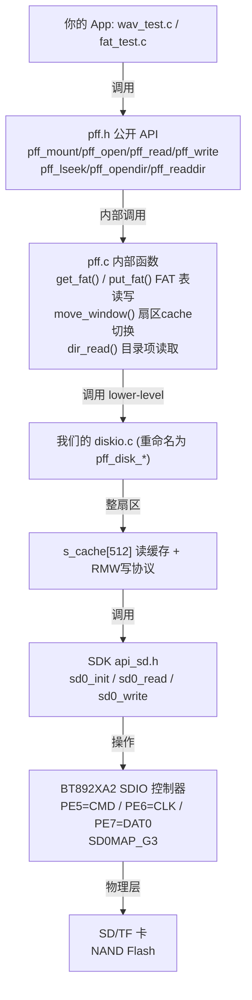
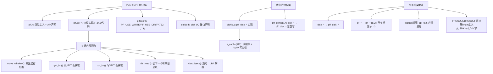

# 05_Petit FatFs 源码导读

> **本篇填空白 #5**：完整追踪 `pff_open("FOO.WAV")` 这条调用的整条链路。
>
> 与 [`fat_test_summary.md`](../fat_test_summary.md) + [`fat_test_*.md`](../fat_test_01_02.md)、[`fat入门指南.md`](../fat入门指南.md) 关系：
> - `fat入门指南` = FAT 卷布局（FAT 表、BPB、cluster chain）  的**学科基础**
> - `fat_test_*` = **实测过程** + 编译整合踩坑
> - **`本篇`** = 源码**逐层导读**——"看到任意一行 `pff_*` 立即能拆出在调谁、谁在调谁"
>
> 读者画像：你已经能 pff_mount + pff_open + pff_read 跑通，并听 wav_test 放出声音。但**改**它或**理解**它跑通为什么 / 跑通时**走读顺序**不明确。

---

## 目录

- [0. 定位：本篇与其他文档关系](#0-定位本篇与其他文档关系)
- [1. adapter 6 层图（最重要一张图）](#1-adapter-6-层图最重要一张图)
- [2. `pff.h` 数据结构 + 完整 FRESULT 表](#2-pffh-数据结构--完整-fresult-表)
- [3. `pffconf.h` 开关：开启哪些 API](#3-pffconfh-开关开启哪些-api)
- [4. `pff.c` 公开函数执行顺序](#4-pffc-公开函数执行顺序)
- [5. `diskio.c` 桥接 + partial-sector cache](#5-diskioc-桥接--partial-sector-cache)
- [6. 与 SDK 符号冲突：`pff_compat.h` 与 include 顺序](#6-与-sdk-符号冲突pff_compath-与-include-顺序)
- [7. 字节序双面性：SD vs FAT/RIFF](#7-字节序双面性sd-vs-fatriff)
- [8. 为何选 Petit FatFs](#8-为何选-petit-fatfs)
- [9. wav_test.c 怎么用这套](#9-wav_testc-怎么用这套)
- [10. 如何安全扩展](#10-如何安全扩展)

---

## 📊 代码流程框架图（adapter 6层调用链）



## 🧠 知识图表（Petit FatFs 核心架构）



---

## 0. 定位：本篇与其他文档关系

| 文档 | 在哪 | 与本篇关系 |
|---|---|---|
| [`fat入门指南 §3-5`](../fat入门指南.md) | BPB / FAT 表 / 簇链 / 寻簇 | 本篇 §2-4 引用，**不再复述** |
| [`fat_test_summary §3`](../fat_test_summary.md) | Petit FatFs 详解 | 本篇**整合 + 提级** |
| [`fat_test_summary §4`](../fat_test_summary.md) | 5 个编译失败案例 | 本篇 §6 完整化 |
| [`wav_test_*.md §2`](../wav_test_01.md) | RIFF/WAVE 文件布局 | 仅 §7 引用 |

---

## 1. adapter 6 层图（最重要一张图）

```
                    ┌─────────────────────────────────────────────────┐
                    │       你的 app / 测试代码                         │
                    │       (wav_test.c, fat_test.c)                  │
                    └────────┬────────────────────────────────────────┘
                             │
                       u8 fno[13]; u32 fsize;
                             │
   ①-②  ─────────────────────▼─────────────────────────────
        ┌─────────────────────────────────────────────────┐
        │  pff.h 公开 API                                  │
        │    pff_mount / pff_open / pff_read / pff_write  │
        │    pff_lseek / pff_opendir / pff_readdir / etc.  │
        └────────┬────────────────────────────────────────┘
                 │ file: FATFS s_fs;   FIL *fp
   ③  ───────────▼─────────────────────────────
        ┌─────────────────────────────────────────────────┐
        │  pff.c 内部函数                                 │
        │    pf_mount -> pf_open -> ...                  │
        │  ── / ───────────────────────────────────────── │
        │  关键函数:                                     │
        │    get_fat() / put_fat()       (FAT 表读/写)    │
        │    move_window()               (扇区 cache 切)   │
        │    dir_read()                  (目录项读)        │
        └────────┬────────────────────────────────────────┘
                 │
                 │ 调用下层 8 个 low-level：
                 │   disk_initialize / disk_readp / disk_writep
                 │   disk_ioctl...
                 │
   ④  ───────────▼─────────────────────────────
        ┌─────────────────────────────────────────────────┐
        │  diskio.c (本项目)                              │
        │    disk_initialize → pff_disk_initialize (重命名)│
        │    disk_readp     → pff_disk_readp (重命名)     │
        │    + 自己的逻辑 (partial sector cache)          │
        └────────┬────────────────────────────────────────┘
                 │
                 │ sd0_read / sd0_write / sd_init /
                 │    sd_ioctl                    (扇区对齐)
                 │
   ⑤  ───────────▼─────────────────────────────
        ┌─────────────────────────────────────────────────┐
        │  bsp_sd.c  (app/platform/bsp/)                 │
        │    bsp_sd0_init / sd0_read / sd0_write         │
        │    + SDIO SFR 寄存器 + CMD17/18/24/25 (SD 协议)  │
        └────────┬────────────────────────────────────────┘
                 │
                 │ SDIO bus (CLK + CMD + D0..D3)
                 │
   ⑥  ───────────▼─────────────────────────────
        ┌─────────────────────────────────────────────────┐
        │  物理 SD 卡                                     │
        │    LBA 0 (MBR+BPB) LBA x (FAT表) LBA y (簇) ... │
        └─────────────────────────────────────────────────┘
```

**核心要点**：
- **任何 pff_* 调用**都能向上追回到你的 app，或向下追到 SFR 寄存器、到物理信号。
- **关键转换点在 diskio.c**：把 pff 扇区级接口翻译到 sd0_read / sd0_write，并加 partial-sector cache。
- **重命名技巧**：Petit FatFs 默认叫 `disk_*` 函数（跟 SDK 闭源 SD 库的 `disk_*` 撞名），所以我们全部加 `pff_` 前缀——在 `pff_compat.h` 一并 rename。

### 1.1 一行总结

```
app → pff_*  → pff.c  → disk_* (重命名 pff_*)  → sd0_* → 物理扇区
```

---

## 2. `pff.h` 数据结构 + 完整 FRESULT 表

### 2.1 三个核心结构体

#### `FATFS` (挂载时一次性构造)

```c
typedef struct {
    u8  fs_type;       // FAT 类型 (0x01 = FAT12, 0x04 = FAT16, 0x08 = FAT32)
    u8  fs_nfats;      // FAT 表个数（通常 2）
    u8  fs_flags;      // bit: FAT12 marker?
    u8  pad;
    u16 fs_csize;      // 每簇扇区数（BPB_BytsPerSec/Clus 算）
    u16 fs_csect;      // 簇位置（FAT 起点...）
    u32 fs_fatbase;    // FAT 起始扇区 LBA
    u32 fs_dirbase;    // FAT32 的根簇
    u32 fs_database;   // 数据区起始扇区 LBA
    u32 fs_n_fat;      // FAT 表计数
    u32 fs_cmask;      // 簇掩码
    u32 fs_shift;      // FAT type, shift 位数 (12/16/32 → 1/2/4 bytes per entry)
    u8  fs_dbcs;       // ?
    // ... uint32 fs_* other fields ...
} FATFS;
```

#### `FIL` (每个打开的文件)

```c
typedef struct {
    u32 fptr;           // 当前读写指针（byte offset）
    u32 fsize;          // 文件大小
    u32 fstart;         // 起始簇 (DATA 簇起点)
    u32 fat_flag;       // 是否 dirty？
    u32 dsect;          // 当前扇区 cache 中的 LBA
    u8  *buf;           // 扇区 cache 指针 (512 字节)
} FIL;
```

#### `DIR` + `FILINFO` (枚举用)

```c
typedef struct {
    u16   index;
    u32   sclust;       // 当前簇
    u32   clust;        // 簇基址
    u8    *fn;          // 8.3 SFN 临时缓冲
    u8    *buf;         // 目录扇区 cache
    // ...
} DIR;

typedef struct {
    u32   fsize;        // 文件大小
    u16   fdate;        // 修改日期 (FAT16 格式)
    u16   ftime;
    u8    fattrib;      // AM_RDO/AM_HID/AM_SYS/AM_VOL/AM_LFN/AM_DIR (1/2/4/8/0xF/0x10)
    char  fname[13];    // 8.3 SFN + NUL (Petit FatFs PF_USE_LCC 决定大小写)
} FILINFO;
```

### 2.2 完整 FRESULT 表

`disk_ioctl` / `pff_*` 都返回这个：

| 码 | 名字 | 含义 |
|---|---|---|
| 0 | `FR_OK` | 成功 |
| 1 | `FR_DISK_ERR` | 底层硬件错（SD 失败 / timeout） |
| 2 | `FR_INT_ERR` | 内部断言错（不应看到） |
| 3 | `FR_NOT_READY` | 驱动未 init / sd_not_found |
| 4 | `FR_NO_FILE` | 文件不存在 |
| 5 | `FR_NOT_OPENED` | 在未 mount / open 时调用 |
| 6 | `FR_NOT_ENABLED` | `PF_USE_WRITE=0` 但调用了 `pff_write` |
| 7 | `FR_NO_FILESYSTEM` | 不是合法的 FAT（没 MBR 或 volume boot） |
| 8 | `FR_BAD_BLOCK_SIZE` | SD 卡扇区 ≠ 512 (Petit 假设 512) |
| 9 | `FR_TIMEOUT` | 等待忙标志超时 |
| 10 | `FR_INVALID_PARAMETER` | 参数无效 |
| 11 | `FR_INVALID_OBJECT` | FIL * / DIR * 无效 |
| 12 | `FR_MKFS_ABORTED` | f_mkfs 被中断 |
| 13 | `FR_NO_SPACE` | 写时簇链耗尽 |
| 14 | `FR_NAME_TOO_LONG` | 文件名 > 12 (8.3) |
| 15 | `FR_NO_PATH` | 路径无效 / 文件已删 |
| 16 | `FR_DENIED` | 只读 / 写保护 |
| 17 | `FR_EXIST` | 重复新建 |
| 18 | `FR_LOCKED` | 文件锁 |
| 19 | `FR_TOO_MANY_OPEN_FILES` | > 1 (Petit 限制) |
| 20 | `FR_INVALID_FAT` | FAT 表校验错 |

> **常用**：FR_OK / FR_DISK_ERR / FR_NOT_READY / FR_NO_FILE / FR_NOT_ENABLED / FR_NO_FILESYSTEM

> ⚠️ 注意：因为 FatFs/Petit FatFs 是不同作者的代码，本 SDK 的 FRESULT 在不同地方定义：
> - `api_fs.h` 里有 SDK 闭库版本
> - `pff.h` 里有 ChaN 版本
> - 两者数值必须对齐才能 dispatch 正确（[§6](#6-与-sdk-符号冲突pff_compath-与-include-顺序) 详）

---

## 3. `pffconf.h` 开关：开启哪些 API

打开 `app/projects/standard/fat_test/pffconf.h`，**6 个** `PF_USE_*` 开关：

| 开关 | 默认 | 我们用 | 作用 |
|---|---|---|---|
| `PF_USE_DIR`        | **1** (Phase 5.4 开) | **1** | 启用 `pff_opendir / pff_readdir` |
| `PF_USE_WRITE`      | 0     | 1        | 启用 `pff_write` |
| `PF_USE_READ`       | 1     | 1        | `pff_read` |
| `PF_USE_LSEEK`      | 0     | 1        | 启用 `pff_lseek` (seek 到 offset) |
| `PF_USE_FIND`       | 0     | 0        | 启用 `pff_findfirst / pff_findnext` |
| `PF_USE_LCC`        | 0     | 0        | 启用大小写转换（小于= 大于写 > 不动 case）|

每一个开关都对应 `pff.c` 里一段 `#if PF_USE_X`。

### 3.1 改效果

| 状态 | 影响 |
|---|---|
| `PF_USE_DIR=0` | 调用 `pff_opendir` 会"unresolved reference" 链接错 |
| `PF_USE_WRITE=0` | 调用 `pff_write` 会 FR_NOT_ENABLED |
| `PF_USE_LSEEK=0` | 无 `pff_lseek` 函数体 → 调用会 unresolved |

### 3.2 Phase 5.4 改了什么

**改前**（`pffconf.h:25`）：
```
#define PF_USE_DIR  0     ← 默认，Phase 4 用不到
```

**改后**：
```
#define PF_USE_DIR  1     ← Phase 5.4 列出播放列表
```

只是一行的改动，**没改** pff.c——可执行代码已经存在，被 `#if 0` 包住。

### 3.3 怎么确认编译有效

Build log 应该看到：

```
Compiling: pff.c
Output:   ~5KB  (PF_USE_DIR=1 多 ~600B)
```

如果 `Output/obj/pff.o` 没生成 → 配置文件没生效。

---

## 4. `pff.c` 公开函数执行顺序

按**最常见的播放一次文件**轨迹走：

### 4.1 流程一：pff_mount → 挂载

```c
FRESULT pff_mount(FATFS *fs) {
    // 1. 调用底层 disk_initialize
    res = disk_initialize(0);                   // → pff_disk_initialize → sd0_init
    if (res) return FR_NOT_READY;

    // 2. 读 LBA 0 (MBR)
    res = disk_readp(bs, 0, 512);
    
    // 3. 解析：找第一个 "FAT volume"
    //    - bs[0x1FE] == 0x55 0xAA  (MBR signature)
    //    - bs[0x1C0..0x1FF] 是 4 个 partition entry（FAT BS 起点）
    //    - 找 type=0x0B/0x0C (FAT32) 或 0x06/0x0E (FAT16)
    
    // 4. 读 BPB（boot record）
    //    - bs[510..511] == 0x55 0xAA?
    //    - bs[0x0B..0x0C] = BytsPerSec (=512)
    //    - bs[0x0D] = SecPerClus (=1, 4, 8, ...)
    //    - bs[0x0E..0x0F] = RsvdSecCnt
    //    - bs[0x10] = NumFATs (usually 2)
    //    - bs[0x24..0x27] = RootDirEntCnt (FAT16, 0 for FAT32)
    //    - bs[0x2C..0x2F] = RootClus (FAT32)
    //    - bs[0x30..0x31] = TotSec32 (FAT32)
    
    // 5. 填入 FATFS 结构体
    fs->fs_csize = bs[0x0D];                    // SecPerClus
    fs->fs_fatbase = ...;                        // part_start + BytsPerSec/512 * RsvdSecCnt (after BS)
    fs->fs_database = ...;                       // FAT start + NumFATs * FATsize
    fs->fs_fsize = ...;                          // 计算得
    fs->fs_n_fat = 2;
    
    return FR_OK;
}
```

**根因**：Petit FatFs 假设 `BytsPerSec == 512`。如果你的卡是 4K 扇区，会 `FR_BAD_BLOCK_SIZE`。

### 4.2 流程二：pff_open → 找文件 + 记录

```c
FRESULT pff_open(const char *path /* SFN */) {
    // 1. follow_path("FOO.WAV"):
    //    - 空路径 = 根目录
    //    - 否则解析路径（但 Petit 不支持子目录）
    
    // 2. dir_read():
    //    - read first root cluster
    //    - scan for 8.3 == "FOO.WAV"  (case insensitive if PF_USE_LCC)
    //    - skip 0xE5 (deleted), '..', AM_VOL
    //    - 但**不** skip AM_LFN (需自己 filter，wav_test.c:208)
    //    - found → fill FILINFO
    
    // 3. 记录到 fp (FIL):
    fp->fstart = clust number (from directory entry)
    fp->fsize = size
    fp->fptr = 0
    fp->dsect = current sect for cache
    
    return FR_OK;
}
```

### 4.3 流程三：pff_read → 缓存扇区 + 输出

```c
FRESULT pff_read(void *buff, UINT btw, UINT *br) {
    while (btw > 0) {
        // 1. 你要的 byte offset fp->fptr 在哪个扇区？
        //    sect = fp->fstart + (fp->fptr / 512)
        //    ofs  = fp->fptr % 512
        
        // 2. 当前缓存 (fp->dsect) 是不是这个 sect？
        //    不匹配 → disk_readp(fp->buf, sect, 512)
        //              （这才是真正的 SD 卡读）
        
        // 3. 从 fp->buf 拷 ofs..(ofs+n) 到 buff
        //    调整 fp->fptr
        
        // 4. btw -= n
    }
    *br = origin - btw;
    return FR_OK;
}
```

**为什么需要 partial-sector cache**：
- `pff_read` 可能请求 4 bytes（FAT 表 entry）、32 bytes（目录项）
- `sd0_read` 必须按**整扇区** 512 字节读
- 所以 Petit 内部**已有**一个 512 字节 cache（`fp->buf`），每次 `pff_read` 先确保 cache 装的是当前扇区
- 但**多个文件同时打开**就不能共享 cache——Petit FatFs 假设**只 1 个文件同时打开**

### 4.4 流程四：pff_lseek → 改 fptr

```c
FRESULT pff_lseek(FIL *fp, DWORD ofs) {
    fp->fptr = ofs;          // 把指针移到 ofs
    dsect = ?                 // 拉个 sect = fstart + (ofs / 512)
    // 不立即 disk_readp，下次 pff_read 时 miss 才读
    return FR_OK;
}
```

`pff_lseek(0)` = 回到文件头；`pff_lseek(64)` = 跳过 64 字节（用来跳过 RIFF 头）。

### 4.5 流程五：pff_opendir + pff_readdir → 枚举

```c
FRESULT pff_opendir(DIR *dj, const char *path /* empty = root */) {
    // 设 dj = 根 cluster
    dj->index = 0;
    dj->sclust = root cluster;
}
FRESULT pff_readdir(DIR *dj, FILINFO *fno) {
    // 顺序读目录项
    // - 0xE5 = 已删（跳）
    // - '.' / '..' = 目录（跳）
    // - AM_VOL = 卷标（跳）
    // - AM_LFN = 长文件名（**不跳**, 你要过滤)
    // - AM_DIR = 子目录（跳）
    // - 其他 = 文件 → 填 fno
    // - 返回 0 = end-of-dir (fno->fname[0] = 0)
}
```

wav_test.c 用法：

```c
while (s_total < WAV_MAX_FILES) {
    fr = pff_readdir(&dj, &fno);
    if (fr != FR_OK) break;
    if (fno.fname[0] == 0) break;  // end
    if (fno.fattrib & (AM_LFN | AM_DIR | AM_VOL)) continue;  // 跳
    if (ext_is_wav(dot)) { /* 收! */ }
}
```

### 4.6 总结表

| 函数 | 调用下层 | 时间复杂度 | 备注 |
|---|---|---|---|
| `pff_mount` | `disk_readp` x ~5 | 几百 ms | 只调用 1 次 |
| `pff_open` | `disk_readp` x ~3 | 几十 ms | 找文件 |
| `pff_read` | `disk_readp` per 512B | 数据量决定 | **扇区级 cache** |
| `pff_write` | `disk_writep` per 512B | 不用我们用 | |
| `pff_lseek` | 不调 | O(1) | |
| `pff_opendir` | `disk_readp` x ~1 | 10ms | |
| `pff_readdir` | `disk_readp` per 512B | 每次+10ms | |

---

## 5. `diskio.c` 桥接 + partial-sector cache

### 5.1 真实代码长啥样

```c
// app/projects/standard/fat_test/diskio.c
#include "include.h"
#include "pff.h"

/* Partial-sector cache: 512 bytes for reads, 512 for writes */
static u8 s_rd_cache[512] __attribute__((aligned(4)));
static u8 s_wr_cache[512] __attribute__((aligned(4)));
// 或合成 1 个，pff 不同时读写同一文件
```

### 5.2 5 个 disk_* 函数

```c
/* 1. disk_initialize: 在 pff_mount 里调 */
DSTATUS disk_initialize(BYTE drv) {
    if (drv) return STA_NOINIT;
    return sd0_init();      // → 实际调 bsp_sd0_init，SDCARD init/identify
}

/* 2. status: 在 pff_mount 之后调（不一定用） */
DSTATUS disk_status(BYTE drv) {
    if (drv) return STA_NOINIT;
    return 0;               // 0 = OK
}

/* 3. disk_readp: 读 sector，0..ff 偏移（partial read 必装） */
DRESULT disk_readp(BYTE *buff, DWORD sector, UINT ofs, UINT cnt) {
    // 1. 装 cache
    if (s_rd_lba != sector) {
        sd0_read(s_rd_cache, sector, 1);   // 读一个扇区进 cache
        s_rd_lba = sector;
    }
    // 2. partial copy
    memcpy(buff, s_rd_cache + ofs, cnt);
    return RES_OK;
}
```

### 5.3 partial sector 的必要性

设想 Petit 调用 `disk_readp(buf, lba, 4, 32)` = 从 LBA `lba` 的偏移 4 起读 32 字节（FAT table entry）。

但 `sd0_read(buf, lba, 1)` 必须是 512 字节 unit。

**解法**：diskio.c **自己用 cache** 装完整扇区，pff 再拷出 ofs..ofs+cnt。

### 5.4 wav_test.c 里 partial-sector 处理

`wav_test.c:678-680`：

```c
const u32 want = (bytes_left < sizeof(s_pcm)) ? bytes_left
                                                : sizeof(s_pcm);
fr = pff_read(s_pcm, want, &n);
// 可能 n < want（文件末端的 partial sector）
```

处理：

```c
if (n == 0) break;
bytes_left -= n;

// 推帧
for (u32 i = 0; i < n / 4; i++) {  // n/4 = 立体声帧数
    AUBUFDATA = src[i];
}
```

**末帧可能不完整**：文件剩余 < 4 bytes 时，n/4 会少一帧，不会崩。

### 5.5 为何不是 s_64byte（FAT entry），而是 s_512byte

- FAT16 entry = 2 字节 → 偏移 = 偶数
- FAT32 entry = 4 字节 → offset = i * 4
- `pff_get_fat()` 内部已经做 partial read，**所以我们不需要 64 B 的小 cache**

---

## 6. 与 SDK 符号冲突：`pff_compat.h` 与 include 顺序

### 6.1 5 个编译错误 case（汇总）

打开 `fat_test_summary.md §4.1`，本 SDK 历史上踩过的 5 个坑：

| # | 错 | 修法 |
|---|---|---|
| 1 | **`disk_initialize undefined` 多重定义** | 改 API 名 → `pff_disk_initialize`（在 `pff_compat.h`） |
| 2 | **`FRESULT redefinition`** (`pff.h` 与 `api_fs.h` 冲突) | `#ifndef FRESULT` 保护，或先 `#include "include.h"` |
| 3 | **注释里 `*/` 提前结束** | 重写注释 |
| 4 | **`#include` 顺序错** | `diskio.c` 必须 `#include "include.h"` **再** `#include "pff.h"` |
| 5 | **链接顺序** | `pff.o` 必须比 `libdrivers.a` 早连（CB：Project 右键 → Properties） |

### 6.2 `pff_compat.h` 全部重命名

```c
// app/projects/standard/fat_test/pff_compat.h
#ifndef PFF_COMPAT_H
#define PFF_COMPAT_H

#define disk_initialize   pff_disk_initialize
#define disk_status       pff_disk_status
#define disk_readp        pff_disk_readp
#define disk_writep       pff_disk_writep
#define disk_ioctl        pff_disk_ioctl
#define get_fattime       pff_get_fattime

// 5 个 disk_* 全部加 pff_ 前缀
// 目的：避免与 libdrivers.a 的 disk_* 撞名

#endif // PFF_COMPAT_H
```

`pff.c` 顶部 `#include "pff_compat.h"`，于是 pff.c 内部调用的 `disk_*` 实际是 `pff_*`。

### 6.3 include 顺序的问题

```c
// 错顺序：
#include "pff.h"           // pff.h 看见 #ifndef FRESULT → 定义
#include "include.h"       // include.h 拉进 api_fs.h → 重新 define FRESULT → 错

// 正确顺序：
#include "include.h"       // 先拉 SDK 头（含 api_fs.h，FRESULT 定义）
#include "pff.h"           // pff.h 看见 #ifndef FRESULT → 不重 define
```

`wav_test.c:41-43` 的顺序：

```c
#include "include.h"
#include "wav_test.h"
#include "pff.h"        /* MUST come after include.h - FRESULT comes from api_fs.h */
```

> 注释里的 "MUST come after" 即是踩坑教训。

### 6.4 `#ifndef FRESULT` 注意点

即使有 `#ifndef FRESULT` 保护，**typedef 也算定义**：

```c
// pff.h 里
typedef enum { FR_OK = 0, ... } FRESULT;
// 即使 FRESULT 已经被 #define 它是个 enum（不完全等价）
// 编译会 warn "incompatible enum" 或 fail
```

**最终方案**：用整数值相等比较，**enum 必须在** SDK 头里先定。

---

## 7. 字节序双面性：SD vs FAT/RIFF

### 7.1 两套字节序

| 来源 | 字节序 | 例 |
|---|---|---|
| **SD 协议（CMD17/24 头）** | **Big-endian** | `sectorsize=0x0200` 大端 |
| **FAT 文件系统** | Little-endian | `BPB 0x00000200` 小端 |
| **RIFF/WAV** | Little-endian | `RIFF size=0x12345678` 小端 |
| **x86/PC** | Little-endian | 写文件时小端 |

所以：
- **SD 通讯层**用大端（CMD17/24 的 LBA 字段）—— `sd0_read` 的 API 自动**帮你换**；
- **FAT 内部数据**是小端；
- **RIFF/WAV**是小端。

### 7.2 SDK 的 macro 帮

```c
// app/platform/header/macro.h
#define GET_BE16(buf, ofs)  ((u16)((u8*)(buf))[(ofs)]<<8  | (u8*)(buf))[(ofs)+1])
#define GET_LE16(buf, ofs)  ((u16)(u8*)(buf))[(ofs)]      | ((u8*)(buf))[(ofs)+1]<<8)
#define GET_BE32(buf, ofs)  ...
#define GET_LE32(buf, ofs)  ...
```

### 7.3 wav_test.c 自己处理小端

```c
// app/projects/standard/wav_test/wav_test.c:109-117
static u16 rd16(const u8 *p) {
    return (u16)p[0] | ((u16)p[1] << 8);
}
static u32 rd32(const u8 *p) {
    return (u32)p[0] | ((u32)p[1] << 8) | ((u32)p[2] << 16) | ((u32)p[3] << 24);
}
```

把 SD 读到 buffer 里的字节流解析成 u16 / u32。**小端**，因为 WAV 文件由 Windows/macOS 写，小端。

---

## 8. 为何选 Petit FatFs

### 8.1 5 个关键约束

| 约束 | 含义 |
|---|---|
| **13 KB BSS** | 必须小 |
| **闭源 SDK 占用率高** | 我们的代码=SDK的可用空间 |
| **单线程/单 buffer** | 简单可靠 |
| **不需要 LFN** | 8.3 短名 OK |
| **不需要 mkdir/rename** | 我们只读 |

### 8.2 对比

| Lib | 代码大小 | 文件数 | LFN | mkdir | License |
|---|---|---|---|---|---|
| **Petit FatFs** R0.03 | ~3 KB (含 .o) | 1 (in 1 mount time) | ❌ | ❌ | MIT |
| **FatFs** R0.13 full | ~12 KB | 任意 | ✅ | ✅ | MIT |
| **本 SDK `fs_*`** | ~20 KB | 任意 | ✅ | ✅ | 闭源 |

选 **Petit FatFs**：

| ✅ Pro | ❌ Con |
|---|---|
| 1 file, 1 vol 够 wav_test 用 | LFN 没 |
| 代码 3 KB 内（剩 ~10 KB 给应用）| 不能 mkdir |
| 全源可读，可改 | 不能多个同时打开 |
| ChaN 老牌稳定 | 没 `f_mkfs` |
| | 不能新建文件（Petit 可以写但实际只能写短名）|

**结论**：Play-only + 单文件 = Petit 最合适。

### 8.3 什么时候换 full FatFs？

- 需要子目录 → full
- 需要存多个文件同时打开 → full
- 需要 LFN (WAV 文件名很长) → full
- 需要修改文件系统（create/rename）→ full

这些**不在** wav_test 需求里。

---

## 9. wav_test.c 怎么用这套

### 9.1 main run 的 happy path

```c
// app/projects/standard/wav_test/wav_test.c — wav_test_run() 简化
{
    /* 1. mount */
    fr = pff_mount(&s_fs);
    if (fr) return;

    /* 2. enum 根目录 */
    pff_opendir(&dj, "");
    while (pff_readdir(&dj, &fno) == FR_OK && fno.fname[0]) {
        // 筛 .WAV，跳 LFN/DIR/VOL
    }

    /* 3. 开第 1 首歌 */
    pff_mount(&s_fs);    // re-mount (Petit 不持久化)
    pff_open("MUSIC.WAV");
    pff_lseek(0);
    pff_read(s_header, 64, &br);  // 读 RIFF 头

    /* 4. 解析 chunks 找 data */
    for (pos = 12; pos + 8 <= s_fs.fsize; ) {
        pff_lseek(pos);
        pff_read(s_header, 8, &br);
        // chunk_size, id...
        if (id == "data") {
            data_offset = pos + 8;
            data_size = chunk_size;
            break;
        }
        pos += 8 + chunk_size + (chunk_size & 1);   // +1 是偶对齐
    }

    /* 5. set DAC speed, push pcm */
    pff_lseek(data_offset);
    while (bytes_left > 0) {
        pff_read(s_pcm, 512, &n);
        // 推帧到 AUBUFDATA
    }
}
```

### 9.2 partial-sector 末尾

```c
// 如果文件剩 200 bytes，会读到：
// pff_read(buf, 512, &n); n = 200;
// bytes_left -= 200; → 0
// 循环退出
//
// 200 bytes = 50 立体声帧
// 推循环：for (i=0; i<50; i++) push AUBUFDATA
// 然后退出
```

### 9.3 关键偏移 +1（chunk_size 偶对齐 RIFF）

```c
pos += 8 + chunk_size + (chunk_size & 1);    // 奇数 +1 对齐
```

RIFF 规定 chunk 字段要偶字节边界。如果 chunk_size = 0x13（19）=奇，加 1 跳过 padding byte。

---

## 10. 如何安全扩展

### 10.1 你想加的功能（现实场景）

| 需求 | 能不能靠改 pff.c |
|---|---|
| LFN 文件名 | ❌ 改不动（Petit 不支持），换 full FatFs |
| 多个文件同时打开 | ❌ 不支持 |
| 改文件名 | ❌ 不支持（PF_USE_WRITE 也不含）|
| 子目录 | ❌ Petit 不支持 |
| 改 mount 时校验 | ✅ 改 `pff_mount` 加 CRC 即可 |

### 10.2 如果一定要扩展

通常这是**该换 full FatFs** 的信号：

- `[pffconf.h:PF_USE_FIND=1]` 启用 `pff_findfirst` 也可能不够
- 复制 `pff.c -> pf.c` 改，**但**你得调出 SDK 1 个 common `FRESULT` enum
- **真要扩展** 通常任务是"在 full FatFs 项目里复刻 wav_test"——重写 `diskio.c` 的 low-level 调用即可

### 10.3 Petit 的替代品

> **现阶段不用想**。等以下任一需要 → 换 full：
> - 多文件
> - LFN
> - 子目录

---

## 附：进一步阅读

| 主题 | 在哪 |
|---|---|
| FAT 盘上布局（基础） | [`fat入门指南 §3-5`](../fat入门指南.md) |
| SD 卡协议 | [`tf_test_01_02`](../tf_test_01_02.md) ~ `tf_test_07` |
| RIFF/WAVE 解析 | [`wav_test_01`](../wav_test_01.md) + `wav入门指南.md` |
| Petit FatFs 真实编译坑 | [`fat_test_summary §4.1`](../fat_test_summary.md) |
| 字节序 | `macro.h:28-36` (SDK GET_BE/LE 宏) |

---

## 总结：核心清单

读完本篇后，**最少要保证**：

- [ ] 能画 **`app → pff_* → pff.c → disk_* (重命名) → sd0_* → 卡`** 这条链路
- [ ] 看到任意一段 pff 调用**能反向**追到根 app
- [ ] 知道 `FRESULT` 完整表 + 我们最常用 ~6 个
- [ ] 知道 **partial sector cache**（512B）是为何必须有
- [ ] include 顺序：`#include "include.h"` 在前，才能拉 SDK 的 FRESULT 定义
- [ ] 知道 `pff_compat.h` 的 `disk_*` 重命名技巧
- [ ] 字节序：**SD 大端（API 已换） / FAT/RIFF 小端**——我们自己 `rd16/rd32`

如果 7 项 ✅——你可以独立看 pff.c 任何一段代码、debug、视情况扩展（或换 full）。
