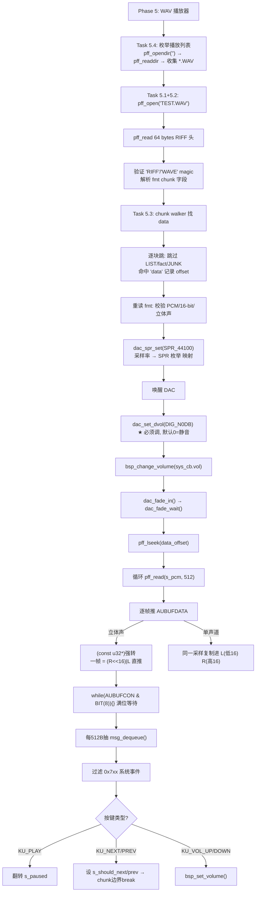

# Phase 5 WAV 播放器 — 完整总结

> Phase 5 全部 4 个子任务完成总结。
> 配套 [docs/任务清单.md](任务清单.md) 的 "WAV 播放器 (Phase 5)" 模块。
> 依赖 Phase 3（TF 裸块读写）+ Phase 4（Petit FatFs 文件读写）。

---

## 📊 代码流程框架图（WAV 播放全链路）



## 🧠 知识图表（WAV 播放器核心概念）

```mermaid
graph TD
    WAV_FILE["WAV 文件 (RIFF 容器)"] --> RIFF["'RIFF' 魔数 + 总大小"]
    WAV_FILE --> WAVE["'WAVE' 格式标识"]
    WAV_FILE --> FMT["'fmt ' chunk: 采样率/声道/位深/PCM标志"]
    WAV_FILE --> DATA["'data' chunk: PCM 音频数据 ★\n(不一定在 offset 44!)"]
    WAV_FILE --> EXTRA["可能有的: LIST/fact/JUNK → chunk walker 跳过"]

    DAC["BT892XA2 DAC 硬件"] --> REG["AUBUFDATA 寄存器: 一次写 u32 = 一整帧"]
    REG --> FRAME["帧格式: bits[15:0]=Left, bits[31:16]=Right\n有符号, 无偏移, 无 XOR"]
    REG --> FIFO["AUBUFCON BIT(8): DACBUF 满位标志\n满时等待自然限速"]
    DAC --> SPR["dac_spr_set(SPR_*): 采样率枚举下标, 不是 Hz"]

    PLAYLIST["Task 5.4 播放列表"] --> ENUM["pff_opendir + pff_readdir\n枚举根目录 *.WAV"]
    PLAYLIST --> WRAP["播完自动下一首, 末尾 wrap 到第一首"]

    KEYS["按键系统"] --> MSG_Q["5ms ISR 入队 → 主循环 msg_dequeue"]
    KEYS --> PWRKEY["pwrkey_table: ADC分压 + 阈值窗口上界"]
    KEYS --> FILTER["必须过滤 0x7xx 系统事件"]

    PITFALLS["4大实测坑"] --> XOR_BUG["^0x8000 + 双写/帧 → 左声道小/人声糊"]
    PITFALLS --> PWRKEY_EN["user_pwrkey_en=False → 按键完全没反应"]
    PITFALLS --> WDT["wav_test 在 func_*外 → WDT不喂狗 → 1-2s重启"]
    PITFALLS --> ADC_47K["47K 高阻源 0裕量阈值 → 30ms防抖吞键"]

    RESULTS["实测结果"] --> PLAY["TEST.WAV 44.1kHz 16-bit 立体声 PASS"]
    RESULTS --> BALANCE["左右声道均衡、人声清晰"]
    RESULTS --> KEYS_OK["3键全通: P/P暂停, PREV上一首, NEXT下一首"]
    RESULTS --> PLAYLIST_OK["4首 WAV 播放列表自动循环"]
```



---

## 1. 任务完成情况

| Task | 描述 | 状态 | 文档 |
|---|---|---|---|
| 5.1 | 建 `wav_test/` 目录 | ✅ | [wav_test_01.md](wav_test_01.md) |
| 5.2 | 从 TF 卡打开一个 WAV（`pff_mount` + `pff_open` + RIFF 头 64B hex dump）| ✅ | [wav_test_01.md](wav_test_01.md) |
| 5.3 | 解析 RIFF + 直推 DAC 播放（`dac_spr_set` + `AUBUFDATA`）| ✅ | [wav_test_02.md](wav_test_02.md) |
| 5.4 | 播放列表 + 按键控制（pause / prev / next / volume）| ✅ | [wav_test_03.md](wav_test_03.md) |

---

## 2. 整体测试结果

**全部 4 个 Task 一次性 PASS**（user-verified 2026-07-29 / 2026-07-30）。详见各子任务文档的"实测输出"小节。

### 2.1 关键里程碑

| 阶段 | 日期 | 用户反馈 |
|---|---|---|
| 5.2 打开 + RIFF 头解析 | 2026-07-29 | 一次 PASS |
| 5.3 直推 DAC 播放 | 2026-07-29 | 第一次"左声道小、人声糊"，定位到 v3-v5 的 `xor 0x8000` + 双写/帧 bug；v8 改成"一次 u32/帧、签名、无 XOR" 一次 PASS |
| 5.4 按键控制 | 2026-07-30 | 4 个实测踩坑（系统事件噪声 / `user_pwrkey_en=False` / WDT 没喂狗 / **47K 高阻源 0 裕量阈值被防抖吞掉**），全部修复后 3 键全 PASS |

### 2.2 最终实测输出（节选）

```
=========================================
  [WAV] BT892XA2 WAV Player Test
  [WAV] SDK V02.00
  [WAV] SDIO mode, SD0MAP_G3 (PE5/6/7)
  [WAV] Phase 5 Part 3: playlist + key controls
=========================================
[WAV] msg queue ready (USER_PWRKEY=1)
[WAV] playlist: 4 song(s)
[WAV]   [1] MUSIC.WAV     52920044 bytes
[WAV]   [2] TEST.WAV      40572078 bytes
[WAV]   [3] 414_1K~1.WAV  ...
[WAV]   [4] 16K_1K.WAV    ...
[WAV] Controls: KU_PLAY=pause/resume, KU_NEXT/PREV=skip, KU_VOL_UP/DOWN=volume

[WAV] --- playing slot 1/4 ---

[WAV] ====== Open + inspect [1/4] MUSIC.WAV ======
[WAV] PASS: file is RIFF/WAVE
...
[WAV] ====== Task 5.3: Parse + Play ======
[WAV]   chunk @0x0000000c: fmt  size=16
[WAV]   chunk @0x00000024: data size=42232512
[WAV] data chunk @44, size=42232512 bytes (~239 sec at 44100 Hz)
[WAV] dac_spr_set(44100 Hz) = SPR enum 1
[WAV] streaming 42232512 bytes of 16-bit stereo PCM at 44100 Hz:
[WAV] (direct AUBUFDATA push, polling AUBUFCON bit 8)
[WAV] 419 / 41242 KB (1%)
[WAV] key 0x0820 -> pause         ← S5 P/P 短按
[WAV] key 0x0820 -> resume
...
[WAV] key 0x0860 -> ...           ← S7 NEXT 短按
[WAV] pushed 403456 bytes (100864 frames) in 3936 ms
[WAV] interrupted (next)
[WAV] slot 1 -> 2 (next)

[WAV] --- playing slot 2/4 ---
[WAV] ====== Open + inspect [2/4] TEST.WAV ======
[WAV]   chunk @0x0000000c: fmt  size=16
[WAV]   chunk @0x00000024: LIST size=26    ← chunk walker 正确跳过
[WAV]   chunk @0x00000046: data size=40572000
[WAV] data chunk @78, size=40572000 bytes (~230 sec at 44100 Hz)
... (开始播 TEST.WAV)
```

---

## 3. 整体技术收获

### 3.1 链路打通

```
SD card (FAT32)           Petit FatFs          RIFF parser            DAC output
┌──────────┐              ┌──────────┐          ┌──────────┐           ┌──────────┐
│ 物理块    │── CMD17 ───▶│ pff_read │── 4B ──▶│ AUBUFDATA│── 1 u32 ─▶│ DACBUF   │
│ .WAV 文件 │              │ (512B    │  帧      │ (push    │  立体声   │ (~2KB)   │──▶ 喇叭
│          │              │ chunked) │          │  signed) │  帧       │          │
└──────────┘              └──────────┘          └──────────┘           └──────────┘
                            Phase 4                Phase 5.3              硬件
```

- **Phase 4** 提供文件读：512B chunked `pff_read`，忽略 4GB 内的寻址细节
- **Phase 5.3** 解析 RIFF（chunk walker 跳过 `LIST`/`fact`/`JUNK`），按采样率调 DAC 节奏，逐帧推 AUBUFDATA
- **Phase 5.4** 加上播放列表（`pff_readdir` 枚举根目录）和按键控制（5ms ISR → msg queue → 主循环抽）

### 3.2 三个关键事实（新手必看）

| 事实 | 出处 | 说明 |
|---|---|---|
| **AUBUFDATA 一次写入 = 一个立体声帧** | [wav_test_02.md §3](wav_test_02.md) | bits[15:0]=L、bits[31:16]=R、**signed**、不 XOR。立体声 PCM 字节序 `[L_lo L_hi R_lo R_hi] LE` 重解释为 `u32` 就是 `(R<<16)|L` —— **可以直接 push**。|
| **`dac_spr_set()` 收 SPR 枚举下标，不是 Hz** | [wav_test_02.md §2](wav_test_02.md) | `SPR_44100 = 1`（不是 44100）。填错采样率播放速度全乱。|
| **5ms ISR 喂键，主循环必须自己 `msg_dequeue()`** | [wav_test_03.md §4.1](wav_test_03.md) | `bsp_key_scan` 在 `usr_tmr5ms_thread` 里跑，独立于主循环；不抽按键就漏。|

### 3.3 四个实测踩坑（避坑指南）

| 坑 | 症状 | 修法 | 文档 |
|---|---|---|---|
| `xor 0x8000` + 双写/帧 | 左声道远小于右、人声糊 | 改成"一次 u32/帧、signed、无 XOR" | [wav_test_02.md §4](wav_test_02.md) |
| `user_pwrkey_en=False` | 按键完全没反应、log 只有 `MSG_SYS_*` 噪声 | [Output/bin/Settings/Boombox.setting:121](app/projects/standard/Output/bin/Settings/Boombox.setting) 翻成 `True` | [wav_test_03.md §7.1](wav_test_03.md) |
| `wav_test_run` 在 `func_*` 框架外 → WDT 不喂狗 | 暂停后 1-2s 重启 | 在两个主循环里加 100ms 周期的 `WDT_CLR()` | [wav_test_03.md §7.2](wav_test_03.md) |
| **S7 (47K 高阻源) 阈值贴实测值，30ms 防抖吞掉按键** | NEXT 按下完全没 log、PREV/PLAY 正常 | `pwrkey_table[2]` 阈值 = 实测 + ≥18 计数（0xD3 → 0xE5），留足向上噪声裕量 | [wav_test_03.md §7.4](wav_test_03.md) |

### 3.4 BSS 预算

| 模块 | 大小 |
|---|---|
| `s_header[64]` (RIFF 头) | 64 B |
| `s_pcm[512]` (.wav_buf 段) | 512 B（DMA-friendly）|
| `s_pl[16][13+4]` 播放列表 | 272 B |
| `s_dir` + `s_info` 目录枚举 | ~40 B |
| `s_paused` / `s_should_next/prev` | 3 B |
| **合计** | **~890 B**（在 SDK `fs_*` 方案 6.3 KB 面前是 1/7）|

---

## 4. 新手入门路径

按这个顺序读 4 个文档，能把 WAV 播放器从 0 跑到能用：

| 步骤 | 读什么 | 跑什么 |
|---|---|---|
| 1 | [wav入门指南.md](wav入门指南.md) | 不用跑，纯格式基础 |
| 2 | [wav_test_01.md §2-4](wav_test_01.md) | 烧录 → 看到 RIFF 头 hex dump |
| 3 | [wav_test_02.md §1-3](wav_test_02.md) | 烧录 → 听到第一首歌 |
| 4 | [wav_test_03.md §1-5](wav_test_03.md) | 烧录 → 3 颗按键控制播放列表 |

如果遇到问题，先看各自文档的"失败排查表"小节（[01](wav_test_01.md) / [02](wav_test_02.md) / [03](wav_test_03.md)）。

---

## 5. 后续可扩展

Phase 5 留下 3 个明显的"可做但没做"扩展，列在这里给后续 Phase 6 准备：

1. **A 律 / μ 律 PCM 解码**：当前只支持 16-bit linear PCM (`wFormatTag=0x0001`)，A 律 (`0x0006`) / μ 律 (`0x0007`) 会被 `parse_and_play()` 直接 `FAIL`。
2. **采样率转换**：只支持 8000/11025/12000/16000/22050/24000/32000/38000/44100/48000 Hz 这 10 个档，其他采样率返回 `0xFFFF`。
3. **真·长按 PWR 关机**：当前 P/P 用 plain `KEY_PLAY=0x20` 规避 `KLH_PLAY_PWR_USER_DEF → FUNC_PWROFF` 路径——意味着没有"长按 P 软关机"。要补回这功能可以加 IOKEY 专做 POWER，或在 wav_test.c 里手动派发 `func_cb.sta = FUNC_PWROFF`。

---

## 7. 进一步阅读（教程系列指针）

本 Phase 5 全部 Task 的**操作步骤 / 实测 log / 单坑分析**见上面 4 个 task 文档。

需要更**系统性**入门或**横向知识**的，请读 [`tutorial_入门/`](tutorial_入门/)：

| 主题 | 推荐读 |
|---|---|
| 工具链 / 烧录 / xmaker | [`01_工具链与构建产物`](tutorial_入门/01_工具链与构建产物.md) |
| 芯片 SFR / GPIO / ADC 读值 | [`02_BT892XA2芯片与外设地图`](tutorial_入门/02_BT892XA2芯片与外设地图.md) |
| 5ms ISR / 消息队列 / WDT / func_run | [`03_SDK架构与运行模型`](tutorial_入门/03_SDK架构与运行模型.md) |
| pwrkey_table / 防抖 / KU/KH/KL / 双开关 | [`04_按键系统完全指南`](tutorial_入门/04_按键系统完全指南.md) |
| pff.c / diskio.c / FRESULT / adapter 6 层图 | [`05_PetitFatFs源码导读`](tutorial_入门/05_PetitFatFs源码导读.md) |
| 任何踩坑第一件事查 | [`06_踩坑大全`](tutorial_入门/06_踩坑大全.md) §8 症状索引表 |
| Phase 1-5 入门 + 下一步 | [`07_Phase导航与下一步`](tutorial_入门/07_Phase导航与下一步.md) |

---

## 6. 一句话总结

> Phase 5 一次性跑通 SD 卡 → Petit FatFs → RIFF parser → AUBUFDATA → DAC 喇叭 全链路，按键控制 3 键全 PASS；
> 四个实测踩的坑（双写/XOR、`user_pwrkey_en`、WDT 喂狗、47K 高阻源 0 裕量阈值被防抖吞掉）都写进了文档避坑表。
