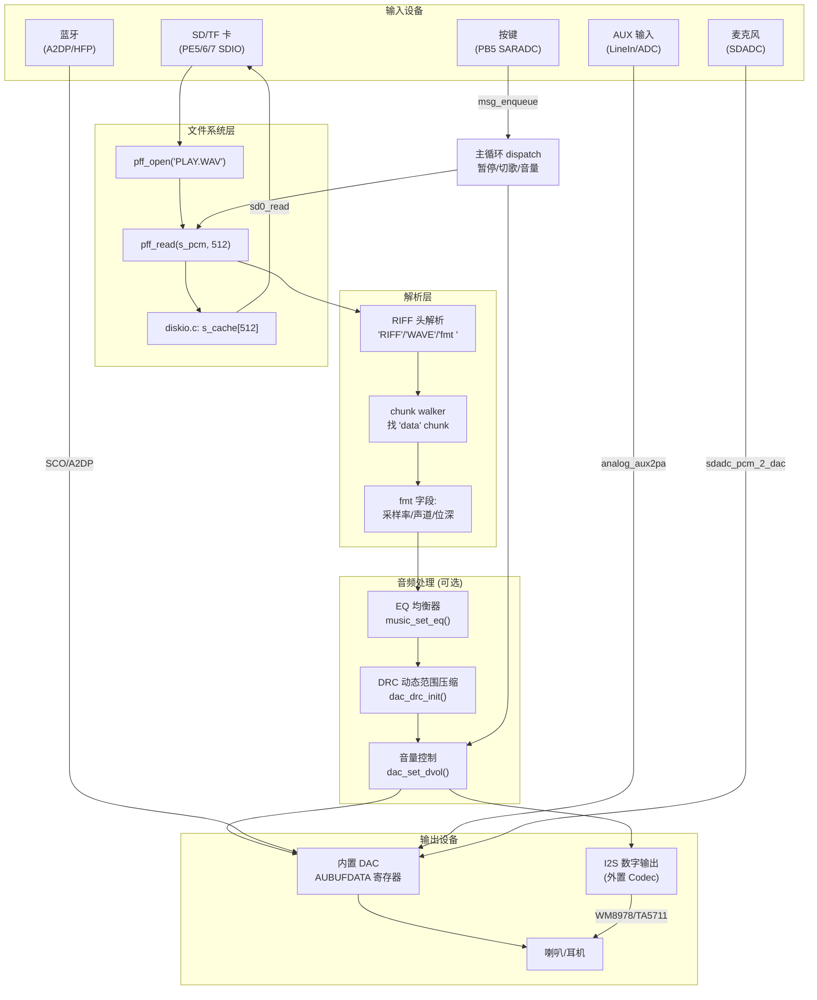
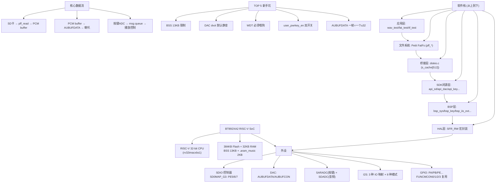

# BT892XA2 SDK 新手入门总纲 — 从零到播放 WAV 音乐

> **定位**：本文是仓库所有文档的 **"总纲"**——把 SD 卡、FAT 文件系统、WAV 音频、ADC 按键、DAC 输出、I2S 数字音频六大子系统串成一条 **完整链路**。
> **读者**：刚 clone 本仓库、学过 C 语言、想快速理解"代码怎么从 SD 卡读到文件并放出声音"的新手。
> **读完本文后**：你能画出整条数据流，知道每段代码在哪个文件，出了问题知道去哪个文档查。
>
> **配套文档地图**（按阅读顺序）：
> 1. [快速入门.md](快速入门.md) — 工具链/编译/烧录/API 速查
> 2. [tutorial_入门/00_新手上路清单](tutorial_入门/00_新手上路清单.md) — 7 步开箱跑通
> 3. 本文（总纲）—— 六大子系统全景
> 4. 各子系统专题文档（见各章末尾的"进一步阅读"）

---

## 目录

1. [全景图：一条完整的数据链路](#1-全景图一条完整的数据链路)
2. [六大子系统速览](#2-六大子系统速览)
3. [子系统一：SD/TF 卡驱动](#3-子系统一sdtf-卡驱动)
4. [子系统二：FAT 文件系统 (Petit FatFs)](#4-子系统二fat-文件系统-petit-fatfs)
5. [子系统三：WAV 音频格式与播放](#5-子系统三wav-音频格式与播放)
6. [子系统四：DAC 数字模拟转换器](#6-子系统四dac-数字模拟转换器)
7. [子系统五：ADC 模数转换与按键](#7-子系统五adc-模数转换与按键)
8. [子系统六：I2S 数字音频接口](#8-子系统六i2s-数字音频接口)
9. [代码导航：改哪里？怎么改？](#9-代码导航改哪里怎么改)
10. [新手常见 10 问](#10-新手常见-10-问)
11. [全部文档索引](#11-全部文档索引)

---

## 1. 全景图：一条完整的数据链路

按下播放键后，数据在 BT892XA2 芯片内部经历以下旅程：

```
┌─────────────────────────────────────────────────────────────────────────┐
│                         数据流全景 (端到端)                               │
├─────────────────────────────────────────────────────────────────────────┤
│                                                                         │
│  SD/TF 卡          Petit FatFs          WAV Parser          DAC 硬件     │
│  ┌──────────┐      ┌──────────┐         ┌──────────┐       ┌──────────┐ │
│  │ NAND     │      │ pff_open │         │ RIFF 头  │       │ AUBUFDATA│ │
│  │ Flash    │──┐   │   ↓      │         │ 解析     │       │ 寄存器   │ │
│  │          │  │   │ pff_read │         │   ↓      │       │   ↓      │ │
│  │ 控制器   │  │   │   ↓      │  512B   │ chunk    │ u32   │ DACBUF   │ │
│  │ (SD协议) │  │   │ get_fat  │ chunked │ walker   │ 帧    │ FIFO     │ │
│  └────┬─────┘  │   │ clust2sect│ ──────▶│ 找 data  │ ────▶│ ~2KB     │ │
│       │        │   └────┬─────┘         └────┬─────┘       └────┬─────┘ │
│       │ CMD17  │        │                     │                  │       │
│       ▼        │        │  diskio.c            │  fmt 字段:       │ 模拟  │
│  ┌──────────┐  │        │  (s_cache[512])     │ 采样率/声道/位深  │ 输出  │
│  │ SDIO     │──┘        └─────────────────────┴──────────────────┤       │
│  │ 控制器   │                                                      ▼       │
│  │ PE5/6/7  │                                                   ┌─────┐   │
│  └──────────┘                                                   │ 喇叭 │   │
│                                                                  └─────┘   │
│                                                                           │
│  按键系统 (ADC)                                                            │
│  ┌──────────┐     ┌──────────┐     ┌──────────┐     ┌──────────┐         │
│  │ 按钮按下  │────▶│ ADC 采样 │────▶│ msg_enq  │────▶│ 主循环    │         │
│  │ S5/S6/S7 │     │ PB5/WKO  │     │ KU_PLAY  │     │ dispatch │         │
│  └──────────┘     └──────────┘     └──────────┘     └──────────┘         │
│                                                                           │
│  I2S 数字音频 (可选, 外接 DAC/Codec)                                        │
│  ┌──────────┐     ┌──────────┐     ┌──────────┐                          │
│  │ I2S TX   │────▶│ 外置DAC  │────▶│ 音响/耳机 │                          │
│  │ BCLK/LRC │     │ WM8978等 │     │          │                          │
│  │ DO/DI    │     └──────────┘     └──────────┘                          │
│  └──────────┘                                                             │
└─────────────────────────────────────────────────────────────────────────┘
```

### 1.1 涉及的关键文件和寄存器

| 层 | 文件/寄存器 | 职责 |
|---|---|---|
| **应用层** | [app/projects/standard/wav_test/wav_test.c](../app/projects/standard/wav_test/wav_test.c) | WAV 播放主逻辑 |
| **文件系统** | [app/projects/standard/fat_test/pff.c](../app/projects/standard/fat_test/pff.c) | FAT 协议实现 |
| **桥接层** | [app/projects/standard/fat_test/diskio.c](../app/projects/standard/fat_test/diskio.c) | partial-sector cache |
| **SD 驱动** | [app/platform/libs/api_sd.h](../app/platform/libs/api_sd.h) | `sd0_init/read/write` |
| **DAC 驱动** | [app/platform/libs/api_dac.h](../app/platform/libs/api_dac.h) | `dac_spr_set/dac_set_dvol` |
| **按键驱动** | [app/platform/bsp/bsp_key.c](../app/platform/bsp/bsp_key.c) | ADC 读 + `pwrkey_table` |
| **I2S 驱动** | [app/platform/bsp/bsp_iis_ext.c](../app/platform/bsp/bsp_iis_ext.c) | I2S 8 种模式 |
| **DAC 寄存器** | `AUBUFDATA` (SFR1+0x04) | 一次写入一个立体声帧 |
| **GPIO 复用** | `FUNCMCON0` | 选 SD/I2S/UART 功能 |

### 1.2 芯片资源速查

| 资源 | 数值 | 说明 |
|---|---|---|
| CPU | RISC-V 32-bit (`rv32imacxbs1`) | 中科蓝讯定制 ISA |
| Flash | ~384 KB | 存代码 + 只读数据 |
| RAM | ~32 KB | 含 BSS 13KB + 栈 + `.aram_music` 2KB |
| SDIO | 1 组 (SD0) | PE5=CMD, PE6=CLK, PE7=DAT0 |
| DAC | 1 组立体声 | 内置, 直接驱动耳机/喇叭 |
| ADC | SARADC (多通道) + SDADC (音频) | SARADC 给按键, SDADC 给麦克风 |
| I2S | 1 组 | 3 种 IO 映射, 8 种工作模式 |
| GPIO | 多组 (PA/PB/PE...) | 通过 `FUNCMCON0/1/2/3` 寄存器复用 |

---

## 2. 六大子系统速览

| 子系统 | 一句话 | 核心 API/文件 | 详细章节 |
|---|---|---|---|
| **SD/TF 卡** | 通过 SDIO 控制器读写 512 字节扇区 | `sd0_init/read/write` | [§3](#3-子系统一sdtf-卡驱动) |
| **FAT 文件系统** | 在裸扇区上建立文件名→扇区号的映射 | `pff_mount/open/read/write` | [§4](#4-子系统二fat-文件系统-petit-fatfs) |
| **WAV 音频** | RIFF 容器, 解析出头信息后拿到 PCM 裸数据 | chunk walker + `fmt`/`data` 解析 | [§5](#5-子系统三wav-音频格式与播放) |
| **DAC** | 把数字 PCM 采样转成模拟电压推给喇叭 | `AUBUFDATA` 寄存器 + `dac_spr_set` | [§6](#6-子系统四dac-数字模拟转换器) |
| **ADC/按键** | 用一根 ADC 线 + 多电阻实现多键检测 | `pwrkey_table` + `bsp_key_scan` | [§7](#7-子系统五adc-模数转换与按键) |
| **I2S** | 数字音频总线, 接外置 DAC/Codec | `iis_cfg_init` + 8 种模式 | [§8](#8-子系统六i2s-数字音频接口) |

---

## 3. 子系统一：SD/TF 卡驱动

### 3.1 知识点

**TF 卡**（micro SD）内部 = **NAND Flash 颗粒** + **控制器芯片**。控制器负责：
- 对外提供标准 SD 协议接口
- 内部做 ECC 纠错、坏块管理、磨损均衡
- 我们只跟控制器打交道，看不到 NAND 细节

**两种通信模式**：
| 模式 | 线数 | 速度 | 本项目用？ |
|---|---|---|---|
| **SPI 模式** | 4 线 (CS/CLK/MOSI/MISO) | 慢 | ❌ |
| **SDIO 模式** (1-bit) | 3 线 (CMD/CLK/DAT0) | 快 | ✅ (SD0MAP_G3, PE5/6/7) |
| **SDIO 模式** (4-bit) | 6 线 (CMD/CLK/DAT0-3) | 最快 | SDK 支持但本项目不用 |

**SD 卡上电鉴定流程**（必须按顺序）：

```
上电 → CMD0 (复位到 idle)
    → CMD8 (询问电压: 支持 2.7~3.6V?)
    → CMD55 + ACMD41 (循环发送, 等 OCR[31]=1 表示初始化完成)
    → CMD58 (读 OCR, 确认 SDHC/SDXC 类型)
    → CMD2/3/9/7 (读 CID/RCA/CSD + 选中卡, 进入 tran 状态)
```

**关键命令**：
| 命令 | 作用 | 参数 |
|---|---|---|
| CMD0 | GO_IDLE_STATE, 复位 | arg=0 |
| CMD8 | SEND_IF_COND, 电压探测 | arg=0x000001AA |
| ACMD41 | SD_SEND_OP_COND, 初始化 | arg=0x40FF8000 (HCS=1) |
| CMD17 | READ_SINGLE_BLOCK, 读一个扇区 | arg=LBA |
| CMD24 | WRITE_SINGLE_BLOCK, 写一个扇区 | arg=LBA |

### 3.2 BT892XA2 上的实现

我们使用 **SD0 控制器 + SD0MAP_G3** 映射：

```
GPIO 复用: FUNCMCON0 = SD0MAP_G3 (0b011)
  PE5 → SDCMD  (命令线, 双向)
  PE6 → SDCLK  (时钟, 主机输出)
  PE7 → SDDAT0 (数据线 0, 双向)
```

**SDK API**（[api_sd.h](../app/platform/libs/api_sd.h)）：

```c
void  sd_gpio_init(u8 type);     // 配 PE5/6/7 + 写 FUNCMCON0
bool  sd0_init(void);            // 完整鉴定（CMD0/8/ACMD41...）
bool  sd0_read (void *buf, u32 lba);  // 读 1 个 512 字节扇区
bool  sd0_write(void *buf, u32 lba);  // 写 1 个 512 字节扇区
u8    sd0_get_rw_sta(void);      // 0=IDLE, 1=READ, 2=WRITE
```

**重要限制**：SDK 只提供**单块**读写（每次 512 字节），没有多块 API。多块操作在应用层循环实现。

### 3.3 代码示例：最简读写

```c
#include "include.h"
#include "api_sd.h"

static u8 s_buf[512] __attribute__((aligned(4)));

void simple_sd_test(void) {
    sd_gpio_init(0);                    // PE5/6/7 → SD 功能
    delay_5ms(10);                      // 等电源稳定

    if (!sd0_init()) {
        printf("SD init FAIL\n");
        return;
    }
    printf("SD init OK\n");

    // 读 LBA 1000
    if (sd0_read(s_buf, 1000)) {
        printf("Read OK, first byte: %02X\n", s_buf[0]);
    }

    // 写 pattern
    for (int i = 0; i < 512; i++) s_buf[i] = (u8)i;
    if (sd0_write(s_buf, 1000)) {
        printf("Write OK\n");
    }
}
```

### 3.4 常见坑

| 坑 | 原因 | 解决 |
|---|---|---|
| `sd0_init` 永远 false | `FUNCMCON0` 没设, PE5/6/7 是普通 GPIO | 先调 `sd_gpio_init(0)` |
| 编译报链接错误 | `MUSIC_SDCARD_EN=0` 导致 `sd_gpio_init` 是空 stub | `config.h` 设 `MUSIC_SDCARD_EN=1` |
| SD 卡不识别 | SD0_MAPPING 不是 G3 | `config.h` 设 `SD0_MAPPING=SD0MAP_G3` |
| 引脚冲突 | PE5/6/7 被 IRRX/SPDIF/ADKEY 占用 | 关 IRRX_HW_EN / 改 SPDIF_CH / 关 USER_ADKEY |

> **进一步阅读**：[tf_test_summary.md](tf_test_summary.md)、[tf_logic_analyzer_guide.md](tf_logic_analyzer_guide.md)、[tutorial_入门/02_BT892XA2芯片与外设地图](tutorial_入门/02_BT892XA2芯片与外设地图.md) §5

---

## 4. 子系统二：FAT 文件系统 (Petit FatFs)

### 4.1 知识点：为什么需要文件系统？

裸扇区读写的困境：

| 问题 | 没有 FS | 有 FS |
|---|---|---|
| 文件在哪？ | 不知道 | `pff_open("README.TXT")` 自动找 |
| 文件多大？ | 不知道 | `s_fs.fsize` 直接读 |
| 跨扇区？ | 手动管理 | FAT 表簇链自动链 |
| 多文件？ | 冲突 | 目录项隔离 |

**FAT32 卷布局**（以我们 8GB SD 卡为例）：

```
LBA 0        LBA 1         LBA 32      LBA 1573
┌─────────┐ ┌──────────┐ ┌──────────┐ ┌──────────────────┐
│ MBR     │ │ VBR(BPB) │ │ FAT 表   │ │ 数据区(根目录+文件) │
│ 0xAA55  │ │ csize=64 │ │ 簇链     │ │ README.TXT 在簇2  │
└─────────┘ └──────────┘ └──────────┘ └──────────────────┘
```

**关键结构**：
- **MBR** (LBA 0)：末尾 `0xAA55` 标志
- **BPB** (BIOS Parameter Block)：`BPB_SecPerClus=64`、`BPB_FATSz32=786`、`BPB_RootClus=2`
- **32 字节目录项**：`DIR_Name[8] + DIR_Name[3] + DIR_Attr + DIR_FstClus + DIR_FileSize`
- **FAT 表**：每个簇 4 字节，`0x0FFFFFFF` = 簇链结束

### 4.2 Petit FatFs 移植架构

我们从 ChaN 的开源 Petit FatFs R0.03a 移植了极简 FAT 实现（约 2KB 代码）：

```
你的 App (wav_test.c)
    │ pff_open("PLAY.WAV")
    ▼
pff.c (FAT 协议: 目录项扫描、FAT 表遍历、簇链追踪)
    │ disk_readp / disk_writep
    ▼
diskio.c (我们的桥接层: s_cache[512] partial-sector 缓存)
    │ sd0_read / sd0_write
    ▼
api_sd.h → SDIO 控制器 → SD/TF 卡
```

**移植关键决策**：
- 所有 `pf_*` 改名为 `pff_*`（SDK 的 `libdrivers.a` 里已有闭源 `pf_*`）
- 所有 `disk_*` 改名为 `pff_disk_*`（同样避免符号冲突）
- 用 `pff_compat.h` 宏隔离，只有 `pff.c` 看到重写
- FRESULT/DRESULT 直接删 enum 定义，统一从 SDK `api_fs.h` 拿

**核心 API**：

```c
FRESULT pff_mount(FATFS* fs);                     // 装载卷
FRESULT pff_open(const char* path);                // 打开文件 (8.3 短名)
FRESULT pff_read(void* buff, UINT btr, UINT* br);  // 读
FRESULT pff_write(const void* buff, UINT btw, UINT* bw); // 写 (需 finalize)
FRESULT pff_lseek(DWORD ofs);                      // 定位
```

### 4.3 Partial-Sector 缓存机制

SDK 只能整扇区（512B）读写，但 Petit FatFs 经常只读 4 字节（FAT 表项）或 32 字节（目录项）。我们的 `diskio.c` 维护一个 512 字节 `s_cache`：

```
读: disk_readp(buf, sector, offset, count)
    → 整扇区读到 s_cache
    → memcpy s_cache[offset..offset+count] → buf
    (同扇区下次读命中免 SD 总线往返)

写: disk_writep(buf, sector)  三阶段协议:
    INIT:  读目标扇区到 s_cache
    DATA:  把新字节覆盖到 s_cache[offset]
    FINAL: 整扇区 sd0_write(s_cache, sector)
```

### 4.4 代码示例：读文件内容

```c
#include "include.h"
#include "fat_test/pff.h"

static u8 s_io[256];

void read_file_demo(void) {
    FATFS fs;
    UINT br;

    if (pff_mount(&fs) != FR_OK) {
        printf("mount FAIL\n"); return;
    }

    if (pff_open("README.TXT") != FR_OK) {
        printf("open FAIL\n"); return;
    }
    printf("fsize = %lu bytes\n", s_fs.fsize);

    pff_read(s_io, sizeof(s_io), &br);
    printf("read %u bytes: %s\n", br, s_io);
}
```

> **进一步阅读**：[fat入门指南.md](fat入门指南.md)、[fat_test_summary.md](fat_test_summary.md)、[tutorial_入门/05_PetitFatFs源码导读](tutorial_入门/05_PetitFatFs源码导读.md)

---

## 5. 子系统三：WAV 音频格式与播放

### 5.1 知识点：WAV = RIFF 容器

WAV 文件 = RIFF 容器, 以 **chunk** 为单位：

```
偏移     内容
0x00     'RIFF'              ← 文件魔数
0x04     RIFF 大小 (小端)     = 文件总长 - 8
0x08     'WAVE'              ← 格式标识
0x0C     'fmt ' chunk:       ← 格式信息
            wFormatTag=1 (PCM)
            nChannels=2 (立体声)
            nSamplesPerSec=44100
            wBitsPerSample=16
0x??     'data' chunk:        ← PCM 音频数据 ★
            (不一定在 offset 44! 可能被 LIST/fact/JUNK 挤到后面)
```

**PCM 帧的磁盘存储**（立体声 16-bit）：

```
磁盘字节: [L_lo L_hi R_lo R_hi]  ← 小端
作为 u32:  (R_hi R_lo L_hi L_lo) = (R<<16) | L
            ↑ 高16位=右声道       ↑ 低16位=左声道
           = 恰好就是 AUBUFDATA 要的帧格式！
```

**关键坑**：
- `data` chunk **不一定**在 offset 44 → 必须用 **chunk walker** 逐块跳
- 所有多字节值都是**小端**（little-endian）
- 采样是**有符号** 16-bit（`0x0000` = 静音），不要做 `^0x8000`！

### 5.2 WAV 播放流水线

```
pff_open("TEST.WAV")
    │
    ▼
读 64 字节 RIFF 头 → 验证 'RIFF'/'WAVE' magic → 解析 fmt 字段
    │
    ▼
chunk walker: pos=12 起, 逐块读 FourCC+Size
    ├── 命中 'fmt ' → 跳过 (已知)
    ├── 命中 'LIST' / 'fact' / 'JUNK' → 跳过
    └── 命中 'data' → 记录 data_offset + data_size
    │
    ▼
采样率 → SPR 枚举映射 (如 44100→SPR_44100=1)
    │
    ▼
唤醒 DAC 序列:
    dac_set_dvol(DIG_N0DB)  ★ 必须调! 默认0=静音
    → bsp_change_volume(sys_cb.vol)
    → dac_fade_in() → dac_fade_wait()
    │
    ▼
pff_lseek(data_offset)
循环 pff_read(s_pcm, 512) → 推 AUBUFDATA
    │
    ▼
立体声: (const u32*)s_pcm → 一帧一推, 零处理！
单声道: 读 u16 → ((u32)s<<16)|s → 复制进左右
    │
    ▼
while (AUBUFCON & BIT(8)) {}  ← DACBUF 满了就等, 天然限速
```

### 5.3 Chunk Walker 原理

```c
u32 pos = 12;  // 跳过 'RIFF'+size+'WAVE', 从第一个子块开始
while (pos + 8 <= s_fs.fsize) {
    pff_lseek(pos);
    pff_read(header, 8, &br);           // 读 FourCC(4B) + Size(4B)
    u32 chunk_size = rd32(header + 4);  // 小端解码
    if (memcmp(header, "data", 4) == 0) {
        data_offset = pos + 8;          // 命中！PCM 从这开始
        data_size   = chunk_size;
        break;
    }
    pos += 8 + chunk_size + (chunk_size & 1);  // &1 = RIFF 字对齐填充
}
```

> **进一步阅读**：[wav入门指南.md](wav入门指南.md)、[wav_test_summary.md](wav_test_summary.md)、[wav_test_02.md](wav_test_02.md) §3（帧格式详解）

---

## 6. 子系统四：DAC 数字模拟转换器

### 6.1 知识点

**DAC**（Digital-to-Analog Converter）把数字 PCM 采样变成模拟电压，驱动耳机/喇叭。

BT892XA2 内置立体声 DAC，关键寄存器：

| 寄存器 | 地址 | 作用 |
|---|---|---|
| `AUBUFDATA` | SFR1 + 0x01×4 | **写一个 u32 = 一帧立体声** (低16=L, 高16=R) |
| `AUBUFCON` | SFR1 + 0x02×4 | 控制寄存器, **BIT(8)=1 表示 DACBUF 满** |
| `AUBUFSIZE` | SFR1 + 0x04×4 | DACBUF 大小 |
| `DACDIGCON0` | SFR1 + 0x10×4 | 数字配置 |
| `DACVOLCON` | SFR1 + 0x11×4 | 音量控制 |

### 6.2 一帧 = 一个 u32

这是整个系统最重要的硬件事实：

```
写一次 AUBUFDATA = 写一整个立体声帧

一个 u32 的内部布局:
  bit[31:16] = 右声道 (有符号 16-bit)
  bit[15:0]  = 左声道 (有符号 16-bit)

示例: 左声道采样 = 0x0A7A (2682), 右声道采样 = 0x0A7D (2685)
  AUBUFDATA = (0x0A7D << 16) | 0x0A7A = 0x0A7D0A7A
```

**三条硬事实**：
1. **有符号**：`0x0000` = 静音，`0x7FFF` = 正峰，`0x8000` = 负峰。**不要 `^0x8000`！**
2. **原样推**：磁盘上的 `[L_lo L_hi R_lo R_hi]` 小端重解释为 u32 正好 = `(R<<16)|L`
3. **BIT(8) 满位等待**：写之前轮询 `AUBUFCON & BIT(8)`，满了就等，空了才写 → 天然实时限速

### 6.3 DAC 唤醒序列

DAC 上电后不是直接能用的，需要一套唤醒流程：

```c
// 1. 设采样率 (传 SPR 枚举, 不是 Hz!)
dac_spr_set(SPR_44100);  // SPR_44100 = 1 (不是 44100!)

// 2. 数字音量 — ★ 上电默认是 0 (静音), 必须拉到 0dB!
dac_set_dvol(DIG_N0DB);   // DIG_N0DB = 32767 / 1.0

// 3. 模拟音量
bsp_change_volume(sys_cb.vol);

// 4. 淡入
dac_fade_in();
dac_fade_wait();           // 等淡入完成
```

### 6.4 采样率映射表

`dac_spr_set()` 接收的是 `SPR_*` 枚举**下标**，不是 Hz 数值：

| WAV 采样率 | SPR 枚举 | 枚举值(=下标) |
|---|---|---|
| 48000 | SPR_48000 | 0 |
| 44100 | SPR_44100 | 1 |
| 32000 | SPR_32000 | 3 |
| 24000 | SPR_24000 | 4 |
| 22050 | SPR_22050 | 5 |
| 16000 | SPR_16000 | 6 |
| 8000 | SPR_8000 | 9 |

**常见坑**：`dac_spr_set(44100)` 传成 44100 而不是 `SPR_44100`(1) → 播放速度全乱。

### 6.5 数字音量宏

`bsp_dac.h` 预定义了 0~-54dB 的数字衰减值：

```c
#define DIG_N0DB   (32767 / 1.000000)    // 0dB   = 满幅度
#define DIG_N6DB   (32767 / 1.995262)    // -6dB  = 一半幅度
#define DIG_N20DB  (32767 / 10.000000)   // -20dB = 1/10 幅度
```

> **进一步阅读**：[wav入门指南.md](wav入门指南.md) §5、[api_dac.h](../app/platform/libs/api_dac.h)、[bsp_dac.h](../app/platform/bsp/bsp_dac.h)

---

## 7. 子系统五：ADC 模数转换与按键

### 7.1 知识点：为什么一根 ADC 线能检测多个按键？

BT892XA2（及大多数蓝牙音箱方案）用**电阻分压 + 单路 ADC** 来检测多个按键：

```
TP17/PB5 (ADC 输入)
  ├── S5 (P/P) → 0Ω → GND       ← 按下时 Vadc=0V,     wko_val≈0x05
  ├── S6 (PREV) → 12KΩ → GND     ← 按下时 Vadc≈1.80V, wko_val≈0x8B
  └── S7 (NEXT) → 47KΩ → GND     ← 按下时 Vadc≈2.72V, wko_val≈0xD3
```

**没有键按下时**：PB5 被内部上拉到 VDD ≈ 3.3V, `wko_val ≈ 0xFF`。

### 7.2 pwrkey_table 查表机制

`bsp_key.c` 的 5ms ISR 里读 PB5 ADC 值（10-bit → 右移 2 位 = 8-bit），然后在 `pwrkey_table[]` 里查找对应按键：

```c
// port_key.c — 我们为 12K/47K 板重排的表
const adkey_tbl_t pwrkey_table[6] = {
    {0x0A, KEY_PLAY},     // S5=0Ω   ADC ≤ 0x0A → PLAY
    {0xA0, KEY_PREV},     // S6=12K   ADC ≤ 0xA0 → PREV
    {0xE5, KEY_NEXT},     // S7=47K   ADC ≤ 0xE5 → NEXT (留18计数裕量!)
    {0xFF, NO_KEY},       // 默认无键
    {0xFF, NO_KEY},
    {0xFF, NO_KEY},
};
```

**查表规则**：`.adc_val` 是窗口**上界**。`while (wko_val > table[num].adc_val) num++` → 落在哪个 slot 就是哪个键。

### 7.3 按键事件流

```
硬件按 S5 ──▶ ADC 读 PB5 ──▶ wko_val=0x05 ──▶ 查表 → KEY_PLAY(0x20)
                                                      │
                                                      ▼ (30ms 防抖: 连续6次相同才确认)
                                            msg_enqueue(KU_PLAY = 0x820)
                                                      │
                                                      ▼ (主循环 msg_dequeue)
                                            wav_test_handle_key(0x820) → s_paused = !s_paused
```

### 7.4 按键编码规则

| 范围 | 含义 | 示例 |
|---|---|---|
| `0x000~0x0FF` | 基础键值 | `KEY_PLAY=0x20` |
| `0x800~0xBFF` | 短按 (KU = Key Up) | `KU_PLAY=0x820` |
| `0xC00~0xFFF` | 长按/按住 (KL/KH) | `KL_PLAY=0xA20` |
| `0x7D0~0x7FF` | **SDK 系统事件** (不是按键!) | `MSG_SYS_500MS=0x7FE` |

**必须过滤** `0x7D0~0x7FF` 范围的系统事件，否则主循环会看到一大堆"假按键"。

### 7.5 两大开关

按键系统有**编译时**和**运行时**两道开关，都必须打开：

| 开关 | 位置 | 作用 |
|---|---|---|
| `USER_PWRKEY=1` | [config.h](../app/projects/standard/config.h) | 编译时包含 PWRKEY 扫描代码 |
| `user_pwrkey_en=True` | [Boombox.setting](../app/projects/standard/Output/bin/Settings/Boombox.setting) L121 | 运行时真正去读 PB5 ADC |

### 7.6 芯片上的两种 ADC

| ADC 类型 | 分辨率 | 用途 | API |
|---|---|---|---|
| **SARADC** | 10-bit | 按键检测、通用模拟量 | `api_saradc.h` |
| **SDADC** (Sigma-Delta) | 16-bit+ | 麦克风音频输入、ANC | `api_sdadc.h` |

> **进一步阅读**：[tutorial_入门/04_按键系统完全指南](tutorial_入门/04_按键系统完全指南.md)、[wav_test_03.md](wav_test_03.md) §5、§7、[tutorial_入门/02_BT892XA2芯片与外设地图](tutorial_入门/02_BT892XA2芯片与外设地图.md) §7

---

## 8. 子系统六：I2S 数字音频接口

### 8.1 知识点

**I2S**（Inter-IC Sound，也叫 IIS）是一种**数字音频总线**标准，用于芯片间传输 PCM 音频数据。BT892XA2 内置 DAC 直接输出模拟音频，但如果你需要接**外置 DAC/Codec**（如 WM8978、TA5711），就要用 I2S。

**I2S 信号线**：

| 信号 | 全称 | 方向 | 作用 |
|---|---|---|---|
| **MCLK** | Master Clock | 主机→从机 | 主时钟, 通常是 256×采样率 |
| **BCLK** | Bit Clock | 主机→从机 | 位时钟, 每个 bit 一个脉冲 |
| **LRC** (WS) | Left-Right Clock | 主机→从机 | 左右声道切换, = 采样率 |
| **DO** | Data Out | 主机→从机 | 音频数据发送 |
| **DI** | Data In | 从机→主机 | 音频数据接收 |

### 8.2 BT892XA2 的 I2S 能力

**3 种 IO 映射**：

| 映射 | MCLK | BCLK | LRC | DO | DI |
|---|---|---|---|---|---|
| IIS_G1 | PA4 | PA5 | PA6 | PA7 | PA3 |
| IIS_G2 | PB1 | **PE5** | **PE6** | **PE7** | PB2 |
| IIS_G3 | PB1 | PB2 | PE6 | PE7 | PB5 |

> ⚠️ **IIS_G2 和 SD0MAP_G3 冲突！** 它们都占用 PE5/PE6/PE7。不能同时使用 SD 卡和 I2S G2。

**8 种工作模式**（`bsp_iis_ext.h`）：

| 模式 | 方向 | 数据来源 | 用途 |
|---|---|---|---|
| `IIS_MASTER_SRCTX` | 主机发 | DAC BUF (SRC 变采样后) | 跟内置 DAC 同步输出 |
| `IIS_MASTER_RAMTX` | 主机发 | DMA 从 RAM 取 | 自定义音频流输出 |
| `IIS_MASTER_RAMRX` | 主机收 | DMA 存到 RAM | 接收外部数字音频 |
| `IIS_SLAVE_RAMRX` | 从机收 | DMA 存到 RAM | 外部 Codec 做主时钟 |
| `IIS_MASTER_RAMTX_RAMRX` | 主机收发同时 | DMA 双向 | 全双工音频 |
| ... | | | |

**关键配置参数**：

```c
typedef struct {
    u8 mode;           // IIS_MASTER_RAMTX 等
    u8 iomap     : 2;  // IIS_G1/G2/G3
    u8 bit_mode  : 1;  // IIS_16BIT / IIS_32BIT
    u8 data_mode : 1;  // IIS_DATA_NORMAL / IIS_DATA_LEFT_JUSTIFIED
    u8 mclk_sel  : 2;  // MCLK/LRC: 64fs / 128fs / 256fs
    u8 mclk_out_en :1; // 是否输出 MCLK
    iis_dma_cfg_t dma_cfg; // DMA 双缓冲配置
} iis_cfg_t;
```

### 8.3 I2S 时钟计算

```
MCLK = 参考时钟 (PLL1DIV) / (mdiv + 1)
BCLK = MCLK / (bdiv + 1)          (bdiv 不能 = 0)
LRC  = BCLK / (位宽 × 2)          = 采样率

示例 (16-bit, 44.1kHz, 256fs):
  LRC  = 44.1 kHz
  BCLK = 44.1k × 32 = 1.4112 MHz
  MCLK = 44.1k × 256 = 11.2896 MHz
```

### 8.4 代码示例：最简 I2S 发送

```c
#include "include.h"
#include "bsp_iis_ext.h"

#define IIS_DMA_SAMPLES  64
#define IIS_DMABUF_LEN   (IIS_DMA_SAMPLES * 2 * 2 * 4)  // tx, rx, double_buf, 4B/frame

static u8  iis_dmabuf[IIS_DMABUF_LEN] __attribute__((aligned(4)));
static iis_cfg_t iis_cfg;

void my_iis_tx_callback(void *buf, u32 samples, bool is_32bit) {
    // DMA 发完一个块，填新数据
    u32 *dst = (u32*)buf;
    for (u32 i = 0; i < samples; i++) {
        dst[i] = generate_next_sample();  // 你的音频生成逻辑
    }
}

void iis_tx_init(void) {
    memset(&iis_cfg, 0, sizeof(iis_cfg));
    iis_cfg.mode        = IIS_MASTER_RAMTX;
    iis_cfg.iomap       = IIS_G3;          // 避开 PE5/6/7 (不和 SD 卡冲突)
    iis_cfg.bit_mode    = IIS_16BIT;
    iis_cfg.data_mode   = IIS_DATA_NORMAL;
    iis_cfg.mclk_sel    = IIS_MCLK_256FS;
    iis_cfg.mclk_out_en = IIS_MCLK_OUT_EN;

    iis_cfg.dma_cfg.samples             = IIS_DMA_SAMPLES;
    iis_cfg.dma_cfg.dmabuf_ptr          = iis_dmabuf;
    iis_cfg.dma_cfg.dmabuf_len          = IIS_DMABUF_LEN;
    iis_cfg.dma_cfg.iis_isr_tx_callbck  = my_iis_tx_callback;

    iis_cfg_init(&iis_cfg);
    iis_start();
}
```

### 8.5 I2S vs 内置 DAC 选型指南

| 场景 | 推荐 | 原因 |
|---|---|---|
| 直接驱动耳机/小喇叭 | **内置 DAC** (AUBUFDATA) | 简单, 不需要外围芯片 |
| 接外部功放/Codec | **I2S** | 数字传输抗干扰, 外置 DAC 音质更好 |
| 需要多路音频输入 | **I2S** | 外置 Codec 多 ADC 通道 |
| 需要 SPDIF 光纤输出 | **I2S** → 外置 SPDIF 芯片 | |

> **进一步阅读**：[bsp_iis_ext.h](../app/platform/bsp/bsp_iis_ext.h)（完整 API 注释 + 配置示例）、[bsp_iis_ext.c](../app/platform/bsp/bsp_iis_ext.c) §1-80（时钟计算）、[3rd-party/i2s/](../app/platform/3rd-party/i2s/)（外置 DAC 驱动）

---

## 9. 代码导航：改哪里？怎么改？

### 9.1 快速决策树

```
想做什么？
│
├─ 改 TF/SD 卡引脚
│   → config.h: SD0_MAPPING
│   → port/port_sd.c
│
├─ 加/关某个功能 (FM/ANC/LED/...)
│   → config.h: *_EN 宏
│   → 联动检查 config_extra.h (自动互斥逻辑)
│
├─ 改按键行为 (按 P 做什么)
│   → message/msg_*.c (按键消息处理)
│   → port/port_key.c → pwrkey_table (按键映射)
│
├─ 改蓝牙名称/LED极性等可视化参数
│   → Output/bin/xcfg.xm (Downloader 里也能改)
│
├─ 改音频 EQ / 音量曲线
│   → plugin/eq_table.c
│   → plugin/multi_lang.c
│
├─ 加自定义音频处理 / 改 DAC 输出逻辑
│   → 在 wav_test.c 或新文件里 hook DAC 回调
│   → 使用 obuf_put_samples() 或直接写 AUBUFDATA
│
├─ 接外部 DAC/Codec (WM8978等)
│   → bsp_iis_ext.c (I2S 配置)
│   → 3rd-party/i2s/ (驱动)
│
└─ 调试 / 独立测试
    → func_idle() (最干净的空闲模式)
    → main.c 里替换 func_run() → 直接调你的测试函数
```

### 9.2 关键文件 TOP 15

| 文件 | 重要性 | 读它的时机 |
|---|---|---|
| [config.h](../app/projects/standard/config.h) | ★★★★★ | 任何功能开关都在这 |
| [main.c](../app/projects/standard/main.c) | ★★★★★ | 启动入口, 改测试入口在这 |
| [include.h](../app/platform/header/include.h) | ★★★★★ | 几乎所有 .c 都 include 它 |
| [api_sd.h](../app/platform/libs/api_sd.h) | ★★★★ | TF/SD 卡读写 |
| [api_dac.h](../app/platform/libs/api_dac.h) | ★★★★ | DAC 输出 |
| [api_sdadc.h](../app/platform/libs/api_sdadc.h) | ★★★★ | 麦克风/ANC/SPR 枚举 |
| [api_key.h](../app/platform/libs/api_key.h) | ★★★★ | 按键扫描 |
| [api_msg.h](../app/platform/libs/api_msg.h) | ★★★★ | 消息队列 |
| [bsp_iis_ext.h](../app/platform/bsp/bsp_iis_ext.h) | ★★★ | I2S 完整配置 |
| [bsp_sys.c](../app/platform/bsp/bsp_sys.c) | ★★★ | 系统初始化 |
| [bsp_key.c](../app/platform/bsp/bsp_key.c) | ★★★ | 按键扫描实现 |
| [pff.c](../app/projects/standard/fat_test/pff.c) | ★★★ | FAT 协议实现 (开源) |
| [diskio.c](../app/projects/standard/fat_test/diskio.c) | ★★★ | FS → SD 桥接 |
| [ram.ld](../app/projects/standard/ram.ld) | ★★★ | 内存分区 (BSS 13KB!) |
| [app.cbp](../app/projects/standard/app.cbp) | ★★★ | Code::Blocks 工程 (新文件必须注册) |

---

## 10. 新手常见 10 问

### Q1: 我新建了一个 .c 文件，编译过了但运行没效果？

**答**：Code::Blocks **不会自动 glob**。必须在 `app.cbp` 里**手动**加 `<Unit filename="..."/>` 注册源文件，还要加 `<Add directory="..."/>` 注册 include 路径。

### Q2: 编译时 `region 'data' overflowed by X bytes`？

**答**：BSS（全局/静态变量）超过了 13KB 限制。
- 缩小 `static` 数组
- 用 `__attribute__((section(".aram_music")))` 放进 SDK 预留的 `.aram_music` 段（2KB）
- 大数据放 SD 卡文件里

### Q3: 串口中文乱码？

**答**：BT892XA2 发 raw UTF-8 字节，Windows 串口助手默认按 GBK 解析。
- 所有 `printf` 用 ASCII 英文
- 或者用支持 UTF-8 的串口工具（如 MobaXterm）

### Q4: `sd0_init()` 一直返回 false？

**答**：查 4 件事：
1. `sd_gpio_init(0)` 调了吗？
2. `MUSIC_SDCARD_EN=1` 了吗？
3. `SD0_MAPPING=SD0MAP_G3` 了吗？
4. PE5/6/7 是否被其他功能占用（IRRX/SPDIF/ADKEY）？

### Q5: 按键完全没反应？

**答**：两道开关都开了吗？
1. `config.h`: `USER_PWRKEY=1`
2. `Boombox.setting` L121: `user_pwrkey_en=True`
3. `pwrkey_table` 阈值跟你的电阻值匹配吗？

### Q6: 播放 WAV 左声道特别轻/人声模糊？

**答**：最经典的声道打包错误——把一帧拆成两次 `AUBUFDATA` 写入、低 16 位填了 0、还做了 `^0x8000`。
**正解**：一个 `u32` 写一整帧，立体声 `(const u32*)` 强转直推，有符号、无 XOR。

### Q7: 播放了一会儿自动重启？

**答**：WDT（看门狗）没喂。SDK 的 `func_process()` 每个主循环都 `WDT_CLR()`，但如果你在 `func_*` 框架外跑自己的测试循环，必须**手动**每 100ms 调一次 `WDT_CLR()`。

### Q8: DAC 没声音输出？

**答**：`dac_set_dvol(DIG_N0DB)` 调了吗？DAC 数字音量寄存器**上电默认是 0（= 静音）**，必须显式拉到满刻度。

### Q9: `pff_open` 返回 `FR_NO_FILE`？

**答**：
- 文件名必须是 **8.3 短格式**（如 `PLAY.WAV`，不是 `playlist.wav`）
- 文件必须在 SD 卡**根目录**（不是子文件夹）
- Petit FatFs 不支持长文件名（LFN）

### Q10: 我怎么知道自己改对了？最快的验证方式？

**答**：三步快速验证：
1. `printf` 到串口看关键变量（115200 8N1, PB3 TX）
2. 逻辑分析仪抓波形（看 SD CLK 有无方波、数据线有无变化）
3. 万用表量引脚电压（比如 PE5/6/7 切换后应该有不同的电平状态）

---

## 11. 全部文档索引

### 总纲与本机文档

| 文档 | 内容 |
|---|---|
| **本文** | 六大子系统全景 + 新手 10 问 |
| [快速入门.md](快速入门.md) | 工具链 / 编译 / 烧录 / API 速查 |
| [任务清单.md](任务清单.md) | Phase 1-6 进度总览 |
| [AGENT_HANDOFF.md](AGENT_HANDOFF.md) | AI 助手接力说明 |

### SD/TF 卡

| 文档 | 内容 |
|---|---|
| [tf_test_01_02.md](tf_test_01_02.md) | Task 1+2: 建目录 + 鉴定流程 |
| [tf_test_03.md](tf_test_03.md) | Task 3: 单块读 (CMD17) |
| [tf_test_04.md](tf_test_04.md) | Task 4: 多块读 |
| [tf_test_05.md](tf_test_05.md) | Task 5: 单块写 (CMD24) |
| [tf_test_06.md](tf_test_06.md) | Task 6: 多块写 |
| [tf_test_07.md](tf_test_07.md) | Task 7: 混合读写 |
| [tf_test_summary.md](tf_test_summary.md) | Phase 3 完整总结 |
| [tf_logic_analyzer_guide.md](tf_logic_analyzer_guide.md) | 逻辑分析仪抓 SD 波形 |

### FAT 文件系统

| 文档 | 内容 |
|---|---|
| [fat入门指南.md](fat入门指南.md) | FAT 格式基础 + 从 LBA0 找到 README.TXT |
| [fat_test_01_02.md](fat_test_01_02.md) | Petit FatFs 移植（含 9 个坑） |
| [fat_test_04.md](fat_test_04.md) | 文件打开/读写测试 |
| [fat_test_summary.md](fat_test_summary.md) | Phase 4 完整总结 |

### WAV 播放器

| 文档 | 内容 |
|---|---|
| [wav入门指南.md](wav入门指南.md) | WAV/RIFF 格式 + DAC 调用链 |
| [wav_test_01.md](wav_test_01.md) | 打开 WAV + 读 RIFF 头 |
| [wav_test_02.md](wav_test_02.md) | 解析 + 直推 DAC 播放 + 声道踩坑 |
| [wav_test_03.md](wav_test_03.md) | 播放列表 + 按键控制 |
| [wav_test_summary.md](wav_test_summary.md) | Phase 5 完整总结 |

### 零基础教程系列 ([tutorial_入门/](tutorial_入门/))

| 文档 | 内容 |
|---|---|
| [00_新手上路清单](tutorial_入门/00_新手上路清单.md) | 7 步开箱 runbook |
| [01_工具链与构建产物](tutorial_入门/01_工具链与构建产物.md) | CB / xmaker / DCF / Downloader |
| [02_BT892XA2芯片与外设地图](tutorial_入门/02_BT892XA2芯片与外设地图.md) | SFR / GPIO / ADC / blinky |
| [03_SDK架构与运行模型](tutorial_入门/03_SDK架构与运行模型.md) | 5ms ISR / 消息队列 / WDT / func_run |
| [04_按键系统完全指南](tutorial_入门/04_按键系统完全指南.md) | pwrkey_table / 防抖 / KU/KH/KL |
| [05_PetitFatFs源码导读](tutorial_入门/05_PetitFatFs源码导读.md) | adapter 6 层图 + pff.c 逐函数 |
| [06_踩坑大全](tutorial_入门/06_踩坑大全.md) | 50+ 踩坑目录 + 症状索引表 |
| [07_Phase导航与下一步](tutorial_入门/07_Phase导航与下一步.md) | Phase 决策树 + 文档地图 |
| [08_SDK分层架构](tutorial_入门/08_SDK分层架构HAL_OSAL_Driver_App.md) | 6 层全景图 + 信号追踪 |

---

## 📊 总纲代码流程框架图



## 🧠 总纲知识全景图



---

> **下一个目标**：你已经掌握了六大子系统的全景。现在打开 [tutorial_入门/00_新手上路清单](tutorial_入门/00_新手上路清单.md)，按 runbook 一步步跑通 hello_world → TF 卡读写 → FAT 文件系统 → WAV 播放器。
>
> 遇到任何问题，第一时间查 [tutorial_入门/06_踩坑大全 §8 症状索引表](tutorial_入门/06_踩坑大全.md)。

